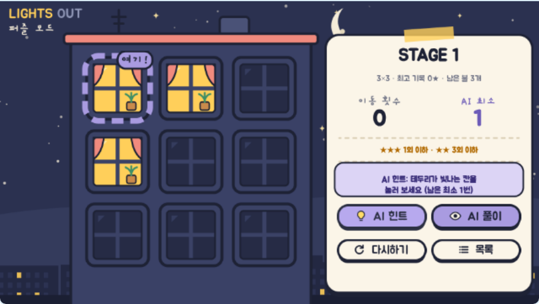
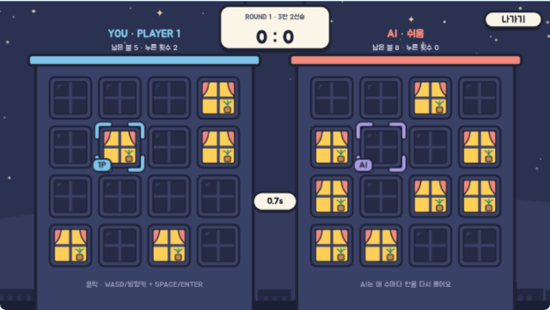
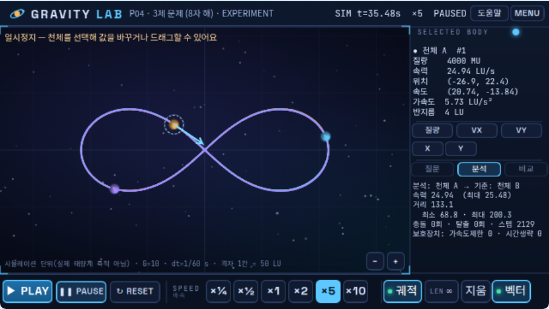
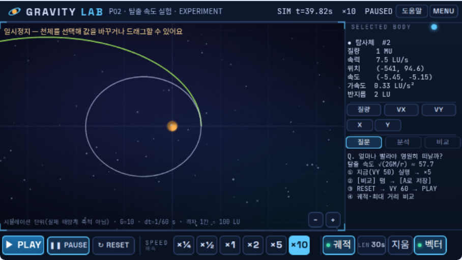

# entry-vibecoding

엔트리(Entry) 작품을 **코드로 설계하고, `.ent` 파일로 만들고, 실제 엔트리 엔진에서 자동으로 검증**하는 바이브 코딩 저장소입니다.

## 작품

| 작품 | 한 줄 소개 | 파일 | 문서 |
|---|---|---|---|
| **LIGHTS OUT** | 모든 불을 끄는 퍼즐 — 퍼즐 모드(AI 힌트) · AI 대전 · 2인 대전 | [`dist/LIGHTS_OUT.ent`](dist/LIGHTS_OUT.ent) | [설계·조사·검증](docs/LIGHTS_OUT.md) · [블록](docs/LIGHTS_OUT_BLOCKS.md) |
| **GRAVITY LAB** | 인터랙티브 중력(N체) 시뮬레이터 | [`dist/GRAVITY_LAB.ent`](dist/GRAVITY_LAB.ent) | [설계·검증](docs/GRAVITY_LAB.md) · [블록](docs/BLOCKS.md) |

## LIGHTS OUT — AI 퍼즐 대전

> 칸을 누르면 그 칸과 상하좌우의 불이 뒤집혀요. 모든 불을 꺼 보세요!

| 퍼즐 모드 (AI 힌트) | AI 대전 |
|---|---|
|  |  |

- **퍼즐 모드 (1인)**: 3×3 → 4×4 → 5×5, 30 스테이지. AI 최소 횟수로 깨면 ★★★, 막히면 **AI 힌트**(한 칸) / **AI 풀이**(전부 표시). 모은 별로 스킨 3종(창문·알전구·별빛) 해금.
- **AI 대전 (1인 vs AI)**: 난이도가 같은 서로 다른 판을 먼저 끄면 승리, 3판 2선승, 난이도 쉬움/보통/어려움, 판 4×4/5×5.
- **2인 대전**: 한 키보드로 P1(WASD+스페이스) vs P2(방향키+엔터), 마우스도 가능.
- **AI 원리**: 판을 0/1 연립방정식(mod 2)으로 보고 가우스 소거 → 해 중 누름 수가 가장 적은 해를 선택 (빌드 때 계산한 행렬을 블록으로 펼쳐 한 프레임에 계산).
- 제작 전 엔트리 **스태프 선정·인기 작품**(ON-OFF 퍼즐, AI 오목, 1인/2인 게임모음 등)과 스태프 선정 기준(독창성·완성도·발전 가능성)을 분석해 구성과 디자인에 반영했습니다 → [docs/LIGHTS_OUT.md](docs/LIGHTS_OUT.md) PART 1.
- **디자인**: Figma 에서 그린 밤 동네 일러스트(창문 칸, 종이 카드, 손글씨 메모) — 설계 코드 `tools/figma/lo_design.js` 를 `use_figma` 로 실행해 편집 가능한 벡터·텍스트·컴포넌트로 만들고, 그 캡처를 잘라 게임 그림으로 씁니다.
- **공정한 대전**: 두 사람은 최소 횟수가 같은 서로 다른 판을 받습니다(회전·뒤집기로도 같지 않음) → 상대(AI)를 따라 누르는 악용이 통하지 않고, 동시에 끄면 무승부입니다.
- 검증: 풀이기 독립 검증(3×3·4×4 전체, 5×5 3000판) + **실제 엔트리 엔진 테스트 47/47 PASS** (따라 누르기 악용 재현 테스트 포함).

실행: playentry.org 작품 만들기 → 파일 → **오프라인 작품 불러오기** → `dist/LIGHTS_OUT.ent` → ▶ 시작하기.

## GRAVITY LAB — 인터랙티브 중력 시뮬레이터

> "중력은 천체의 움직임을 어떻게 바꿀까?"
> 천체의 초기 조건 설정 → 실행 → 관찰 → 조건 변경 → 다시 실험하는 작은 우주 물리 실험실

| 8자 궤도 3체 문제 | 탈출 속도 A/B 비교 |
|---|---|
|  |  |

### 바로 실행하기

1. [`dist/GRAVITY_LAB.ent`](dist/GRAVITY_LAB.ent) 를 내려받습니다.
2. playentry.org 에 로그인한 뒤 작품 만들기 화면의 파일 메뉴에서 **오프라인 작품 불러오기**를 눌러 `.ent` 파일을 엽니다. (엔트리 오프라인 에디터에서도 열 수 있지만, 구버전은 함수 지역 변수를 지원하지 않을 수 있어요.)
3. 무대의 **▶ 시작하기**를 누르고, 화면의 **실험 시작 / 프리셋 실험 / 사용 방법** 중 하나를 고릅니다.

조작: 천체 클릭 = 선택 (N 키: 다음 천체) · 오른쪽 패널에서 질량/속도 입력 · 스페이스 = 재생/일시정지 · R = 초기화

### 주요 기능

- 뉴턴 만유인력 N체 시뮬레이션 (최대 8개), dt = 1/60 s 고정 + 서브스텝 (배속을 바꿔도 결과가 같음)
- 충돌 시 질량 보존 · 운동량 보존 병합, 관측 범위 이탈 = 탈출
- 궤적(길이 3/10/30초/∞), 속도 벡터, 확대·축소
- 프리셋 5종 (2체 궤도 · 탈출 속도 · 쌍성계 · 3체 8자 해 · 자유 실험) + 실험 질문
- BASIC / EXPERIMENT / SANDBOX 모드
- 분석(속력·거리 최대/최소, 충돌·탈출, 보호장치 작동 횟수) + 실험 A 저장 후 비교(수치 + 흐린 궤적)
- 입력 검증(숫자 아님 / 0 이하 질량 / 범위 초과 → 거부 또는 제한)

자세한 설계·검증 보고서: **[docs/GRAVITY_LAB.md](docs/GRAVITY_LAB.md)**
작품의 모든 블록(엔트리 블록 문구): **[docs/BLOCKS.md](docs/BLOCKS.md)**

## 개발 환경

| 필요한 것 | 용도 |
|---|---|
| Node.js 22 이상 | 빌드·테스트 스크립트 |
| Chromium (playwright-core) | 그림 생성, 실제 엔트리 엔진 테스트 |
| lamejs (npm) | LIGHTS OUT 효과음 MP3 인코딩 |
| git, tar | 하네스 준비, `.ent` 패키징 |

```bash
npm install            # 개발 도구 (entryjs 엔진, 글꼴, playwright-core)
npm run art            # (선택) 그림 다시 만들기 → assets/
npm run build          # assets/ + 블록 코드 → dist/GRAVITY_LAB.ent, docs/BLOCKS.md
npm run test:ref       # 기준 시뮬레이터 자체 검증 (해석해 비교)
npm run test:setup     # 엔트리 테스트 하네스 준비 (최초 1회)
npm run test:entry     # .ent 를 실제 entryjs 엔진에 불러와 TEST 01~10 등 44개 테스트
npm run test:perf      # 천체 수 · 배속별 프레임 측정

# LIGHTS OUT
npm run lo:preview     # (선택) 그림 설계를 로컬에서 미리 보기 → build/preview/
npm run lo:figma-script # (선택) Figma use_figma 용 빌드 스크립트 → tools/figma/out/
npm run lo:slice       # Figma 캡처(tools/figma/export/) → assets/lights_out/ 그림·섬네일
npm run lo:sound       # (선택) 효과음 다시 만들기 → assets/lights_out/sound/
npm run lo:build       # → dist/LIGHTS_OUT.ent, docs/LIGHTS_OUT_BLOCKS.md
npm run lo:test:solver # AI 풀이기 독립 검증 (BFS · 불 쫓기)
npm run lo:test        # .ent 를 실제 entryjs 엔진에서 47개 테스트
```

`npm run build` 는 Node 만 있으면 됩니다. 그림(`assets/`)은 저장소에 포함되어 있습니다.

## 구조

```
dist/GRAVITY_LAB.ent        완성 작품
assets/                     그림 (2배 해상도 PNG, gl_art.js 가 생성)
docs/                       설계·검증 보고서, 블록 목록, 스크린샷
tools/entrygen.js           엔트리 블록 JSON 생성 DSL (블록·함수·지역 변수·리스트)
tools/gl_physics.js         물리 엔진 (쌍 중력, 천체 이동, 병합, 서브스텝)
tools/gl_layout.js          화면 레이아웃
tools/gl_art.js             그림 생성
tools/build_gravity_lab.js  작품 조립 + .ent 패키징
tools/gl_blockdoc.js        작품 → 엔트리 블록 문구 문서
tools/test/                 기준 시뮬레이터, 실제 엔진 테스트 하네스

dist/LIGHTS_OUT.ent         LIGHTS OUT 완성 작품
assets/lights_out/          그림(2배 PNG + thumb/, Figma 캡처에서 자름) · sound/(MP3)
tools/lo_solver.js          GF(2) 풀이기 · 스테이지 생성
tools/lo_layout.js          화면 레이아웃 · 버튼 · 난이도 · 스킨
tools/figma/lo_design.js    그림 설계 (Figma 빌드 · 로컬 미리보기 공용)
tools/figma/lo_figma_script.js, lo_figma_patch.js   use_figma 스크립트 생성 (전체 / 일부)
tools/figma/lo_slice.js     검은·흰 배경 캡처 → 투명도 복원 → 그림 자르기
tools/figma/export/         Figma 시트 캡처 원본
tools/lo_sound.js           효과음 합성 (PCM → MP3, lamejs)
tools/build_lights_out.js   작품 조립 + .ent 패키징(그림·섬네일·소리)
tools/test/lo_solver_selftest.js, tools/test/harness/lo_suite.js   검증
```

### 이 저장소에서 알게 된 엔트리 엔진 특성 (entryjs 4.0.23)

- `반복하기` 블록은 **한 바퀴마다 한 프레임** 쉽니다 → 무거운 계산은 블록을 펼치거나 함수로 나눠 한 프레임에 끝내야 합니다.
- 일반 변수는 **숨겨져 있어도** 값이 바뀔 때마다 표시 크기를 다시 계산합니다 → 반복 계산의 중간값은 함수 지역 변수가 훨씬 빠릅니다.
- `그리고`/`또는` 블록은 양쪽을 **모두** 계산합니다 → 리스트 0번째 항목 읽기 같은 오류는 `만약`을 겹쳐서 막아야 합니다.
- 리스트 범위를 벗어난 항목을 읽거나 바꾸면 작품이 멈춥니다.
- 블록 이름 `set_effect_amount` 는 "효과를 ~만큼 **주기**"(더하기), `change_effect_amount` 가 "~(으)로 **정하기**" 입니다.
- 그림의 투명한 부분은 클릭이 통과합니다.
- `.ent` = `temp/project.json` + `temp/xx/yy/image|thumb/<파일ID>.png` (+ `sound/<파일ID>.mp3`) 를 묶은 tar.gz 입니다.
- `~이 될 때까지 반복하기`는 조건을 **먼저** 확인합니다 → 이전 값이 조건을 만족하면 한 번도 안 돕니다.
- 화면 전체를 덮는 그림(반투명이라도)은 클릭을 가로챕니다 → 아래 칸으로 넘기거나 투명하게 그려야 합니다.
- 변수 이름은 오브젝트 지역 변수까지 포함해 작품 전체에서 달라야 합니다.
