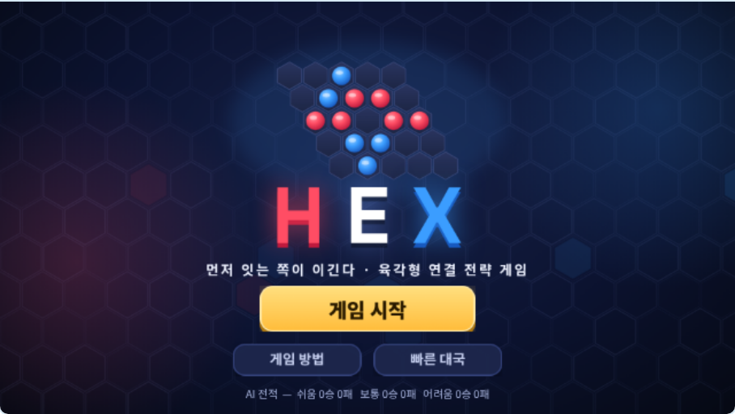
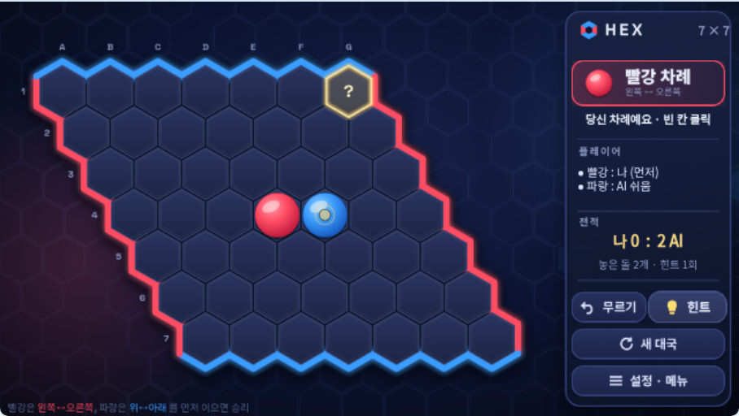
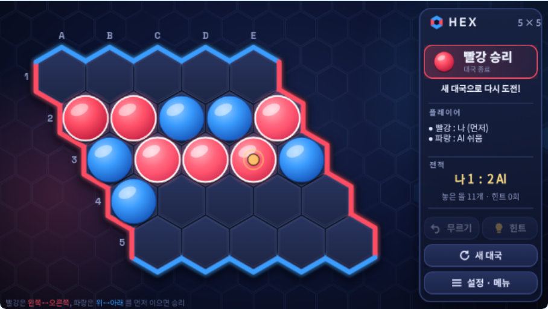

# entry-vibecoding

엔트리(Entry) 작품을 **코드로 설계하고, `.ent` 파일로 만들고, 실제 엔트리 엔진에서 자동으로 검증**하는 바이브 코딩 저장소입니다.

## HEX — AI와 두는 육각형 연결 전략 게임 (NEW)

> 빨강은 왼쪽↔오른쪽, 파랑은 위↔아래. **먼저 이으면 이긴다.** 무승부 없는 헥스 보드게임.
> 미완성이던 4×4 헥스 작품(`hex.ent`)을 완전히 새로 만든 업그레이드 버전입니다.

| 타이틀 | AI 대전 · 힌트 | 승리 길 표시 |
|---|---|---|
|  |  |  |

1. [`dist/HEX.ent`](dist/HEX.ent) 를 내려받아 playentry.org → 작품 만들기 → 파일 → **오프라인 작품 불러오기**
2. ▶ 시작하기 → **게임 시작** → 대전 방식 · AI 난이도 · 보드 크기 · 내 색 고르고 **대국 시작**

- **AI 대전** 쉬움 · 보통 · 어려움 (거리 지도 + 브리지 + 1수 탐색 AI, 기준 JS 구현과 같은 수를 두는지 실제 엔진에서 검증)
- **2인 대전**, 보드 **5×5 · 7×7 · 9×9**, **무르기**, **힌트**, 이긴 길 반짝임, 효과음, 게임 방법 화면
- 원본 분석 · AI 설계 · 검증 결과: **[docs/HEX.md](docs/HEX.md)** · 전체 블록: **[docs/HEX_BLOCKS.md](docs/HEX_BLOCKS.md)**

```bash
npm run hex:build       # assets/hex → dist/HEX.ent
npm run hex:test:ai     # AI 알고리즘 검증 · 난이도별 대국
npm run hex:test:entry  # 실제 entryjs 엔진 테스트 (npm run test:setup 먼저)
```

## GRAVITY LAB — 인터랙티브 중력 시뮬레이터

> "중력은 천체의 움직임을 어떻게 바꿀까?"
> 천체의 초기 조건 설정 → 실행 → 관찰 → 조건 변경 → 다시 실험하는 작은 우주 물리 실험실

| 8자 궤도 3체 문제 | 탈출 속도 A/B 비교 |
|---|---|
|  |  |

### 바로 실행하기

1. [`dist/GRAVITY_LAB.ent`](dist/GRAVITY_LAB.ent) 를 내려받습니다.
2. playentry.org 에 로그인한 뒤 작품 만들기 화면의 파일 메뉴에서 **오프라인 작품 불러오기**를 눌러 `.ent` 파일을 엽니다. (엔트리 오프라인 에디터에서도 열 수 있지만, 구버전은 함수 지역 변수를 지원하지 않을 수 있어요.)
3. 무대의 **▶ 시작하기**를 누르고, 화면의 **실험 시작 / 프리셋 실험 / 사용 방법** 중 하나를 고릅니다.

조작: 천체 클릭 = 선택 (N 키: 다음 천체) · 오른쪽 패널에서 질량/속도 입력 · 스페이스 = 재생/일시정지 · R = 초기화

### 주요 기능

- 뉴턴 만유인력 N체 시뮬레이션 (최대 8개), dt = 1/60 s 고정 + 서브스텝 (배속을 바꿔도 결과가 같음)
- 충돌 시 질량 보존 · 운동량 보존 병합, 관측 범위 이탈 = 탈출
- 궤적(길이 3/10/30초/∞), 속도 벡터, 확대·축소
- 프리셋 5종 (2체 궤도 · 탈출 속도 · 쌍성계 · 3체 8자 해 · 자유 실험) + 실험 질문
- BASIC / EXPERIMENT / SANDBOX 모드
- 분석(속력·거리 최대/최소, 충돌·탈출, 보호장치 작동 횟수) + 실험 A 저장 후 비교(수치 + 흐린 궤적)
- 입력 검증(숫자 아님 / 0 이하 질량 / 범위 초과 → 거부 또는 제한)

자세한 설계·검증 보고서: **[docs/GRAVITY_LAB.md](docs/GRAVITY_LAB.md)**
작품의 모든 블록(엔트리 블록 문구): **[docs/BLOCKS.md](docs/BLOCKS.md)**

## 개발 환경

| 필요한 것 | 용도 |
|---|---|
| Node.js 22 이상 | 빌드·테스트 스크립트 |
| Chromium (playwright-core) | 그림 생성, 실제 엔트리 엔진 테스트 |
| git, tar | 하네스 준비, `.ent` 패키징 |

```bash
npm install            # 개발 도구 (entryjs 엔진, 글꼴, playwright-core)
npm run art            # (선택) 그림 다시 만들기 → assets/
npm run build          # assets/ + 블록 코드 → dist/GRAVITY_LAB.ent, docs/BLOCKS.md
npm run test:ref       # 기준 시뮬레이터 자체 검증 (해석해 비교)
npm run test:setup     # 엔트리 테스트 하네스 준비 (최초 1회)
npm run test:entry     # .ent 를 실제 entryjs 엔진에 불러와 TEST 01~10 등 44개 테스트
npm run test:perf      # 천체 수 · 배속별 프레임 측정
```

`npm run build` 는 Node 만 있으면 됩니다. 그림(`assets/`)은 저장소에 포함되어 있습니다.

## 구조

```
dist/GRAVITY_LAB.ent        완성 작품
assets/                     그림 (2배 해상도 PNG, gl_art.js 가 생성)
docs/                       설계·검증 보고서, 블록 목록, 스크린샷
tools/entrygen.js           엔트리 블록 JSON 생성 DSL (블록·함수·지역 변수·리스트)
tools/gl_physics.js         물리 엔진 (쌍 중력, 천체 이동, 병합, 서브스텝)
tools/gl_layout.js          화면 레이아웃
tools/gl_art.js             그림 생성
tools/build_gravity_lab.js  작품 조립 + .ent 패키징
tools/gl_blockdoc.js        작품 → 엔트리 블록 문구 문서
tools/test/                 기준 시뮬레이터, 실제 엔진 테스트 하네스
```

### 이 저장소에서 알게 된 엔트리 엔진 특성 (entryjs 4.0.23)

- `반복하기` 블록은 **한 바퀴마다 한 프레임** 쉽니다 → 무거운 계산은 블록을 펼치거나 함수로 나눠 한 프레임에 끝내야 합니다.
- 일반 변수는 **숨겨져 있어도** 값이 바뀔 때마다 표시 크기를 다시 계산합니다 → 반복 계산의 중간값은 함수 지역 변수가 훨씬 빠릅니다.
- `그리고`/`또는` 블록은 양쪽을 **모두** 계산합니다 → 리스트 0번째 항목 읽기 같은 오류는 `만약`을 겹쳐서 막아야 합니다.
- 리스트 범위를 벗어난 항목을 읽거나 바꾸면 작품이 멈춥니다.
- 블록 이름 `set_effect_amount` 는 "효과를 ~만큼 **주기**"(더하기), `change_effect_amount` 가 "~(으)로 **정하기**" 입니다.
- 그림의 투명한 부분은 클릭이 통과합니다.
- `.ent` = `temp/project.json` + `temp/xx/yy/image|thumb/<파일ID>.png` 를 묶은 tar.gz 입니다.
