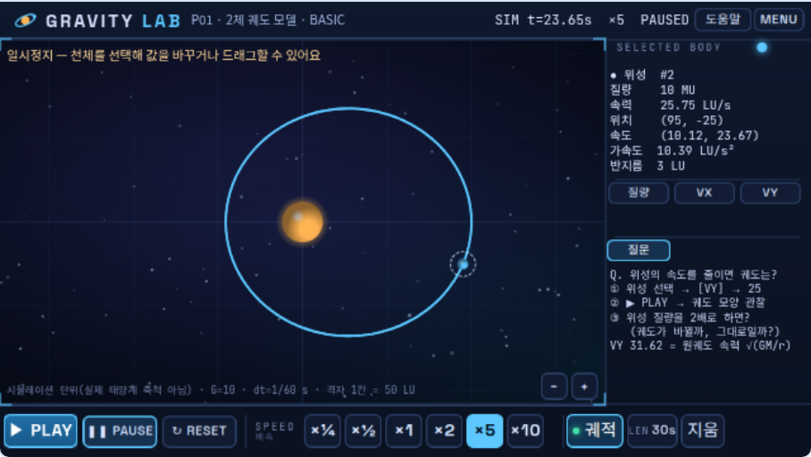
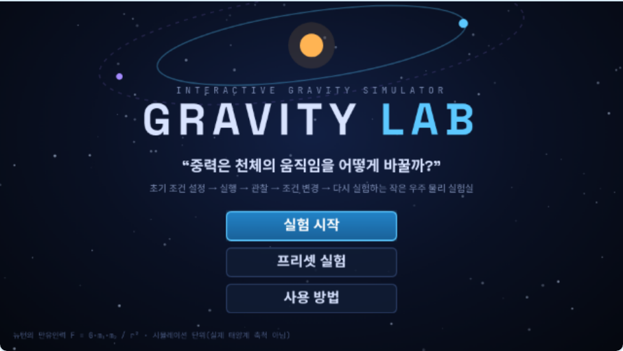
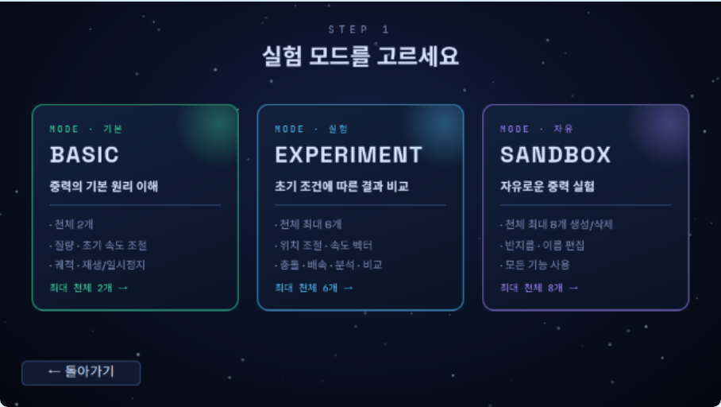
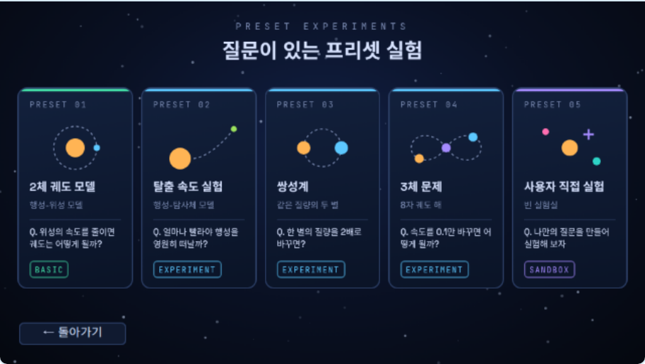

# GRAVITY LAB — 설계 · 구현 · 검증 보고서

엔트리(Entry)에서 실행하는 인터랙티브 중력 시뮬레이터입니다.
사용자가 천체의 초기 조건을 정하고 → 실행하고 → 관찰하고 → 조건을 바꿔 → 다시 실험하는 **샌드박스형 물리 실험실**이에요.

- 작품 파일: [`dist/GRAVITY_LAB.ent`](../dist/GRAVITY_LAB.ent)
- 전체 블록 목록(엔트리 블록 문구): [`docs/BLOCKS.md`](BLOCKS.md)
- 생성·검증 도구: [`tools/`](../tools)

> **검증 범위**: 모든 테스트는 npm 으로 받은 **실제 엔트리 엔진(entryjs 4.0.23)** 을 헤드리스 크롬에서 띄워 `.ent` 를 불러온 뒤 실행했습니다.
> playentry.org 사이트에 직접 업로드하는 과정은 이 환경에서 접속할 수 없어 **검증하지 못했습니다**.

---

## 개발 방식 (STEP 1 ~ 10 진행 기록)

| STEP | 한 일 | 실패 가능성 점검 결과 |
|---|---|---|
| 1 구현 가능성 분석 | entryjs 소스를 읽어 반복·함수·변수·붓·복제본의 실제 동작 확인 | 반복 블록은 **한 바퀴마다 한 프레임** 쉼 → N² 계산을 반복 블록으로 하면 불가능. 펼쳐서 해결 |
| 2 아키텍처 | 오브젝트 17개(버튼은 복제본), 함수 43개, 신호 1개 | 오브젝트 수 최소화(버튼 45개 → 오브젝트 1개 + 복제본) |
| 3 데이터 구조 | 8칸 고정 슬롯 리스트 + 활성 플래그 | 리스트 항목 삭제 시 번호가 밀리는 문제 → 삭제 대신 비활성화 |
| 4 최소 물리 엔진 | 쌍 중력 · 천체 이동 · 물리 한 스텝 · 물리 프레임 | 일반 변수 갱신이 느림(아래 DISCOVER 1) → 함수 지역 변수 |
| 5 검증 | JS 기준 시뮬레이터와 스텝 단위 비교 | 1e-13 수준으로 일치 |
| 6 기능 확장 | 충돌·병합, 탈출, 분석, 비교, 프리셋 5종 | 병합은 쌍 계산 안에서 즉시 처리 |
| 7 UI | 시작/모드/프리셋/도움말 화면, 실험 화면 | 투명 픽셀 클릭 통과 등 수정 |
| 8 성능 최적화 | 사용 슬롯까지만 계산, 프레임당 최대 스텝 조절 | 8개 × 10배속 15fps → 31fps |
| 9 전체 테스트 | TEST 01~10 포함 44개 자동 테스트 | 44/44 통과 |
| 10 최종 검증 | 완료 조건·품질 기준 검토 (이 문서 끝) | 미검증 항목 명시 |

---

## PART 1. 엔트리 구현 가능성 분석

| 기능 | 구현 난이도 | 엔트리 구현 가능성 | 위험 요소 | 대체 방법(채택) |
|---|---|---|---|---|
| N체 중력 계산 | 중 | 가능 | 반복 블록은 1바퀴 = 1프레임 → 28쌍을 반복하면 28프레임 소요 | 반복 대신 **함수 호출을 펼쳐** 한 프레임 안에 계산 |
| 작은 dt 여러 번(서브스텝) | 중 | 가능 | 위와 같음 | `만약 누적시간 ≥ dt` 블록 10개를 펼침 |
| 리스트 기반 천체 데이터 | 하 | 가능 | 항목 삭제 시 뒤 번호가 당겨져 천체·궤적·선택이 뒤섞임 | **8칸 고정 슬롯** + `활성` 0/1 |
| 계산 중간값 저장 | 하 | 가능 | 일반 변수는 값이 바뀔 때마다 (숨겨져 있어도) 글자 폭을 다시 잼 → 계산이 2배 느림 | **함수 지역 변수** 사용 |
| 충돌·병합 | 중 | 가능 | 이미 사라진 천체를 다시 계산, 중복 병합 | 쌍 계산 안에서 즉시 병합, 사라진 쪽 `활성=0` → 이후 쌍에서 자동 제외 |
| 궤적 (최근 N개만 유지) | 상 | 부분 가능 | 붓 선은 일부만 지울 수 없음. 점 목록을 매 프레임 다시 그리면 반복 블록 때문에 불가 | 슬롯마다 **붓 2개를 번갈아 지우기** → 최근 약 P~2P초 유지 (P = 3/10/30초/∞) |
| 속도 벡터 | 하 | 가능 | 너무 긴 화살표 | 붓으로 매 프레임 다시 그림, 표시 길이 = 속력×1.2, 최대 60px |
| 천체 선택(클릭) | 하 | 가능 | 작은 천체는 클릭이 어려움, 투명 픽셀은 클릭이 통과 | 마우스 좌표에서 **가장 가까운 천체**(반지름+6px 이내) 선택 |
| 값 입력 | 하 | 가능 | 숫자가 아닌 값, 범위 밖 값 | `묻고 기다리기` + `숫자인가?` + 범위 제한 + 안내 문구 |
| 실시간 그래프 | 상 | 불안정 | 매 프레임 여러 점을 그리려면 반복 블록 필요 → 성능 저하 | **궤적 겹쳐 보기 + 수치 비교 + 기록 리스트**(엑셀로 내보내기 가능) |
| 실험 A/B 비교 | 중 | 가능 | 이미 그린 붓 선은 나중에 흐리게 바꿀 수 없음 | 0.2초마다 좌표를 **리스트에 기록** → 저장할 때 흐린 선으로 다시 그림(확대해도 다시 그려짐) |
| 드래그로 위치 이동 | 중 | 가능 | 클릭만 해도 천체가 마우스 위치로 튐 | 잡은 지점 차이(오프셋) 유지, 1px 이상 움직였을 때만 이동 |
| 천체 8개 × 10배속 | 상 | 부분 가능 | O(N²) + 엔트리 사칙연산(BigNumber) 비용 | 천체 수에 따라 프레임당 최대 스텝 10/6/4 → 반응성 유지, **실제 배속을 화면에 표시** |
| 버튼 45개 | 중 | 가능 | 오브젝트가 너무 많아짐 | 버튼 오브젝트 1개 + 복제본(버튼 번호 = 지역 변수) |
| 시작/모드/프리셋/도움말 화면 | 하 | 가능 | – | 화면 오브젝트 1개의 모양 4개 |

---

## PART 2. 전체 시스템 아키텍처

### 오브젝트 (위 → 아래 = 화면 앞 → 뒤)

| 오브젝트 | 종류 | 역할 |
|---|---|---|
| 버튼 | 오브젝트 + 복제본 45개 | 모든 버튼. 복제본마다 `내버튼`(지역 변수)으로 번호를 가짐. 클릭 → `눌린버튼` 설정 → 신호 `버튼 눌림` |
| 화면 | 오브젝트 | 시작 / 모드 선택 / 프리셋 / 도움말 화면 (모양 4개) |
| 상단_프리셋, 상단_시간 | 글상자 | 프리셋 이름·모드 / 시뮬레이션 시간·배속·상태 |
| 정보패널, 하단패널 | 글상자 | 선택 천체 정보 / 질문·분석·비교 탭 |
| 안내, 단위표시 | 글상자 | 안내·오류 메시지 / 단위계 표시 |
| 패널 | 오브젝트 | UI 패널 덮개(시뮬레이션 영역만 뚫림 → 궤적이 패널 밖으로 나가도 가려짐) |
| 충돌효과 | 오브젝트 + 복제본 | 병합 위치에 퍼지는 빛 효과 |
| 속도벡터 | 오브젝트(붓) | 선택 천체의 속도 화살표 |
| 선택표시 | 오브젝트 | 선택 천체의 점선 링 |
| 천체 | 오브젝트 + 복제본 8개 | 슬롯 1~8 천체 표시 (`내번호` = 슬롯) |
| 비교궤적 | 오브젝트(붓) | 저장한 실험 A의 경로(흐린 선) |
| 궤적 | 오브젝트 + 복제본 16개(붓) | 슬롯마다 붓 2개로 최근 궤적 표시 |
| 시뮬레이터 | 오브젝트(관리자) | 메인 루프(물리 → 사건 확인 → 분석), 마우스·키보드 입력 |
| 배경 | 오브젝트 | 우주 배경 + 격자 |

### 데이터 흐름

```
[UI INPUT] 버튼 복제본 클릭 ─▶ 신호 '버튼 눌림' ─▶ [버튼 처리] ─▶ 상태/데이터 변경 ─▶ [버튼 갱신]
           마우스 클릭(시뮬레이터) ─▶ [마우스 천체 찾기] / [천체 추가] / 드래그
           묻고 기다리기 ─▶ 검증(숫자·범위) ─▶ 리스트에 반영

[PHYSICS LOOP] 시뮬레이터 '계속 반복하기' (1프레임 1회)
   만약 상태 = RUNNING:
      [물리 프레임] ─▶ [물리 한 스텝] × n ─▶ [쌍 중력](최대 28) ─▶ [천체 병합]
                                          └▶ [천체 이동](최대 8) ─▶ 탈출 처리
      [종료 검사] (충돌·탈출이 생겼을 때만)
[ANALYSIS]  [분석 기록] · [비교 경로 기록]      ← 물리 계산이 끝난 뒤 '관찰만'
[RENDER]    천체·궤적·벡터·선택표시·글상자가 각자 리스트를 읽어 그림
```

물리 계산과 그리기는 완전히 분리되어 있습니다. 물리는 리스트만 바꾸고, 그리는 오브젝트들은 리스트를 읽기만 합니다.

### 변수 (주요)

| 분류 | 변수 |
|---|---|
| 상태 | `화면`(START/MODE/PRESET/HELP/SIM) · `상태`(START/READY/RUNNING/PAUSED/RESETTING/FINISHED) · `모드` · `프리셋번호` · `선택천체` · `입력중` · `배치대기` · `탭` |
| 물리 | `중력상수`=10 · `dt`=1/60 · `프레임시간`=1/60 · `배속` · `누적시간` · `시뮬레이션시간` · `스텝수` · `최소거리제곱`=4 · `최대가속도`=20000 · `이탈거리`=2000 · `사용슬롯` · `프레임최대스텝` |
| 표시 | `중심X`,`중심Y` · `배율` · `궤적표시` · `궤적주기` · `궤적세대` · `궤적끊기` · `벡터표시` |
| 분석 | `분석대상` · `기준천체` · `현재속력` · `현재거리` · `최대속력` · `최소거리` · `최대거리` · `충돌횟수` · `탈출횟수` |
| 비교 | `비교A저장` · `A_…`(초기 속력·질량, 최대 속력, 최소/최대 거리, 충돌·탈출, 결과, 시간) · `비교샘플수` |

전역 변수 87개, 지역 변수(복제본용) 12개, 함수 지역 변수 94개. 전체는 [BLOCKS.md](BLOCKS.md) 참고.

### 리스트

| 리스트 | 크기 | 뜻 |
|---|---|---|
| `천체ID` `이름` `질량` `X` `Y` `VX` `VY` `반지름` `색상` `활성` | 8 | **같은 번호 = 같은 천체** |
| `FX` `FY` `AX` `AY` | 8 | 힘 누적 / 마지막 가속도(표시용) |
| `초기_이름` … `초기_활성` | 8 | 실험 시작 순간의 조건(RESET 복원용) |
| `색상코드` | 8 | 붓 색 |
| `보호작동` | 2 | 최대 가속도 제한 작동 횟수 / 계산 한도 초과로 생략한 횟수 |
| `버튼X` `버튼Y` `버튼상태` `버튼모양` | 53 | 버튼 위치·상태(0 숨김, 1 보통, 2 켜짐, 3 비활성)·모양 |
| `효과X` `효과Y` `효과크기` | ≤8 | 충돌 효과 대기열 |
| `기록_시간` `기록_속력` `기록_거리` | ≤100 | 0.5초마다 분석 기록 (엔트리에서 엑셀로 내보내기 가능) |
| `비교X` `비교Y` | 2400 | 실험 A 경로(300샘플 × 8슬롯) |

**데이터 구조를 바꾼 점**: 요구사항의 `선택 상태` 리스트 대신 `선택천체` 변수 하나를 씁니다. 선택은 항상 하나뿐이라 리스트보다 단순하고 오류가 적습니다.

### 신호

`버튼 눌림` 하나만 씁니다. 나머지 흐름은 사용자 정의 함수 호출로 처리해 실행 순서가 명확합니다.

### 사용자 정의 함수 (43개)

| 묶음 | 함수 |
|---|---|
| 물리 | `물리 프레임` · `물리 한 스텝` · `쌍 중력 (i)(j)` · `천체 이동 (i)` · `천체 병합 (i)(j)` |
| 데이터 | `슬롯 (k) 설정 …` · `초기 조건 저장/복원` · `사용 슬롯 계산` · `실험 상태 초기화` · `표시 기본값` · `프리셋 1~5 데이터` · `프리셋 불러오기` · `프리셋 (n) 시작` |
| 상태 | `실험 재생` · `실험 일시정지` · `실험 초기화` · `종료 검사` |
| 입력 | `버튼 처리` · `버튼 갱신` · `마우스 천체 찾기` · `다음 천체 선택` · `천체 추가 (x)(y)` · `질량/VX/VY/X/Y/반지름/이름 편집` |
| 분석 | `분석 대상 설정` · `기준 천체 찾기` · `분석 기록` · `실험 A 저장` · `비교 경로 기록` · `실효 배속 측정` |
| 그리기 | `속도 벡터 그리기` · `비교 궤적 전체 그리기` · `비교 궤적 조각 (s)(j)` |

---

## PART 3. 물리 엔진 설계

### 단위계 (시뮬레이션 단위 — 실제 태양계 축척이 아님)

| 양 | 단위 | 값 |
|---|---|---|
| 길이 | LU | 확대 ×1에서 1 LU = 1 px |
| 질량 | MU | 행성 10000, 위성 10 등 |
| 시간 | s (시뮬레이션 초) | 실제 시간과 다름. 화면에 `SIM t = …` 로 표시 |
| 중력상수 | G | 10 (LU³ / (MU·s²)) |

물리 좌표(LU)와 화면 좌표(px)는 분리되어 있습니다: `화면x = 중심X + x × 배율`. 격자 한 칸 = 50 px = 50/배율 LU 를 화면에 표시합니다.

### 중력 계산 (요구사항 4·8)

각 물리 스텝:
1. 모든 천체의 `FX`, `FY` = 0
2. 천체 쌍 (i < j) 을 한 번씩만 순회 (사용 슬롯까지만, 최대 28쌍)
3. `dx = xj − xi`, `dy = yj − yi`, `r² = dx² + dy²`
4. 충돌 검사 `r² ≤ (ri + rj)²` → 병합
5. 아니면 `r² < ε²` 이면 `r² = ε²` (ε = 2 LU, **수치 안정성 보호 장치**)
6. `|F| = G·mi·mj / r²`, `Fx = |F|·dx/r`, `Fy = |F|·dy/r`
7. **작용·반작용**: `FXi += Fx`, `FXj −= Fx` (한 쌍을 한 번만 계산)
8. 모든 쌍이 끝난 뒤 천체마다 `a = F/m` → `v ← v + a·dt` → `x ← x + v·dt` (반암시적 오일러, 에너지 보존이 좋은 심플렉틱 방법)

### 시간 적분 (요구사항 6)

```
누적시간 ← 누적시간 + 프레임시간(1/60 s) × 배속
누적시간 ≥ dt(1/60 s) 인 동안 (최대 '프레임최대스텝' 회) : 물리 한 스텝, 누적시간 −= dt
여전히 남으면 남은 시간을 버리고 '시간생략' 횟수를 기록
```

- **배속을 바꿔도 dt 는 항상 1/60 s** 입니다. ×10 은 dt=10/60 한 번이 아니라 dt=1/60 을 10번 계산합니다. 그래서 같은 조건이면 배속과 관계없이 결과가 같습니다.
- ×0.25 는 4프레임에 한 번 계산합니다(누적시간 방식).
- 한 프레임 최대 스텝: 천체 3개 이하 10, 5개 이하 6, 그 이상 4. 컴퓨터가 따라가지 못하면 시뮬레이션이 느려지고 상단에 `(실제×2.1)` 처럼 실제 진행 배속을 보여 줍니다.

### 충돌 · 병합 (요구사항 9·10)

- 판정: `r ≤ r1 + r2`
- 남는 천체 = 더 무거운 쪽(같으면 앞 번호), 사라지는 천체는 `활성 = 0`
- `m = m1 + m2`, 위치 = 질량 중심, `vx = (m1·vx1 + m2·vx2)/(m1+m2)`, `vy` 도 같은 방식
- 새 반지름 = `∛(r1³ + r2³)` (밀도가 같다고 가정한 부피 보존; 엔트리에 세제곱근 블록이 없어 뉴턴법 4회)
- 두 천체가 이번 스텝에 받던 힘은 합칩니다. 둘 사이의 힘은 합치면 상쇄되므로 정확합니다.
- **처리 순서 변경과 이유**: 요구사항 10의 "충돌 목록 기록 → 병합" 방식은 목록을 돌 때 반복 블록이 필요해 프레임이 끊깁니다. 그래서 쌍 계산 안에서 **바로 병합**하고, 사라진 천체는 `활성 = 0` 으로 만들어 이후 쌍에서 자동으로 빠지게 했습니다. 한 스텝 안에서 같은 천체가 두 번 병합되는 일이 없고(비활성은 건너뜀), 이미 삭제된 천체를 계산하는 일도 없습니다.
- 병합된 천체의 궤적 붓은 지워지고, 병합 위치에 효과가 짧게 나타납니다.

### 수치 안정성 보호 장치 (요구사항 7)

| 장치 | 값 | 설명 |
|---|---|---|
| 최소 거리 | ε = 2 LU | `r² < 4` 이면 4로 계산 |
| 최대 가속도 | 20000 LU/s² | 넘으면 방향은 유지하고 크기만 제한. **물리 법칙을 바꾸는 장치**이므로 작동 횟수를 분석 탭에 표시 |
| 관측 범위 | ±2000 LU | 벗어나면 `탈출`로 처리(비활성). 탈출 실험의 결과이자 숫자 폭주 방지 |
| 계산 한도 | 프레임당 4~10 스텝 | 넘는 시간은 생략하고 횟수 표시 |
| 입력 제한 | 질량 0.001~1000000, 속도 ±500, 위치 ±1000, 반지름 1~40 | 범위 밖은 최대/최소값으로 제한 |

---

## PART 4. 엔트리 블록 구현 순서

전체 블록은 [BLOCKS.md](BLOCKS.md)에 **엔트리 블록 문구 그대로** 나와 있습니다(자동 생성, 약 3,200줄).
아래는 직접 따라 만들 때의 순서입니다.

### ① 오브젝트 만들기
배경 → 시뮬레이터 → 궤적 → 비교궤적 → 천체(모양 8개) → 선택표시 → 속도벡터 → 충돌효과 → 패널 → 글상자 6개 → 화면(모양 4개) → 버튼(모양 69개)

### ② 변수 만들기
PART 2 변수 표. `내버튼`·`내갱신`(버튼), `내번호`(천체), `궤적번호`·`궤적버퍼`·`궤적세대값`·`궤적끊기값`·`궤적구간`·`그리는중`(궤적), `효과크기값`(충돌효과), `내화면`(화면), `비교그림세대`(비교궤적)은 **"이 오브젝트에서 사용"** 으로 만듭니다. 복제본마다 값이 따로 필요하기 때문입니다.

### ③ 리스트 만들기
PART 2 리스트 표. 천체 리스트는 모두 **8칸**으로 미리 채웁니다.

### ④ 사용자 정의 함수 만들기 (물리 → 데이터 → 상태 → 입력 → 분석 순)

```
[함수 정의하기 쌍 중력 (i) (j)]            지역 변수: dx dy r2 rs r f fx fy
  [만일 <<([활성] 의 (i) 번째 항목) = (1)> 그리고 <([활성] 의 (j) 번째 항목) = (1)>> (이)라면]
    [[dx] 를 (([X] 의 (j) 번째 항목) - ([X] 의 (i) 번째 항목)) (으)로 정하기]
    [[dy] 를 (([Y] 의 (j) 번째 항목) - ([Y] 의 (i) 번째 항목)) (으)로 정하기]
    [[r2] 를 ((([dx] 값) x ([dx] 값)) + (([dy] 값) x ([dy] 값))) (으)로 정하기]
    [[rs] 를 (([반지름] 의 (i) 번째 항목) + ([반지름] 의 (j) 번째 항목)) (으)로 정하기]
    [만일 <<([충돌사용] 값) = (1)> 그리고 <([r2] 값) ≤ (([rs] 값) x ([rs] 값))>> (이)라면]
      [천체 병합 (i) (j)]
    [아니면]
      [만일 <([r2] 값) < ([최소거리제곱] 값)> (이)라면]
        [[r2] 를 ([최소거리제곱] 값) (으)로 정하기]
      [[r] 를 (([r2] 값) 의 루트) (으)로 정하기]
      [[f] 를 (((([중력상수] 값) x ([질량] 의 (i) 번째 항목)) x ([질량] 의 (j) 번째 항목)) / ([r2] 값)) (으)로 정하기]
      [[fx] 를 ((([f] 값) x ([dx] 값)) / ([r] 값)) (으)로 정하기]
      [[fy] 를 ((([f] 값) x ([dy] 값)) / ([r] 값)) (으)로 정하기]
      [[FX] (i) 번째 항목을 (([FX] 의 (i) 번째 항목) + ([fx] 값)) (으)로 바꾸기]
      [[FY] (i) 번째 항목을 (([FY] 의 (i) 번째 항목) + ([fy] 값)) (으)로 바꾸기]
      [[FX] (j) 번째 항목을 (([FX] 의 (j) 번째 항목) - ([fx] 값)) (으)로 바꾸기]
      [[FY] (j) 번째 항목을 (([FY] 의 (j) 번째 항목) - ([fy] 값)) (으)로 바꾸기]
```

```
[함수 정의하기 물리 한 스텝]
  [[FX] (1) 번째 항목을 (0) (으)로 바꾸기]  … 8칸 FX, FY 모두 0
  [만일 <([사용슬롯] 값) ≥ (2)> (이)라면]
    [쌍 중력 (1) (2)]
  [만일 <([사용슬롯] 값) ≥ (3)> (이)라면]
    [쌍 중력 (1) (3)]  [쌍 중력 (2) (3)]
  …  (8까지)
  [만일 <([사용슬롯] 값) ≥ (1)> (이)라면]
    [천체 이동 (1)]
  …  (8까지)
```

```
[함수 정의하기 물리 프레임]                지역 변수: acc n
  [[acc] 를 (([누적시간] 값) + (([프레임시간] 값) x ([배속] 값))) (으)로 정하기]
  [[n] 를 (0) (으)로 정하기]
  [만일 <<([acc] 값) ≥ ([dt] 값)> 그리고 <([n] 값) < ([프레임최대스텝] 값)>> (이)라면]
    [물리 한 스텝]
    [[acc] 를 (([acc] 값) - ([dt] 값)) (으)로 정하기]
    [[n] 를 (([n] 값) + (1)) (으)로 정하기]
  … (같은 '만일' 블록 10개)
  [[누적시간] 를 ([acc] 값) (으)로 정하기]
  [만일 <([n] 값) > (0)> (이)라면]
    [[시뮬레이션시간] 를 (([시뮬레이션시간] 값) + (([n] 값) x ([dt] 값))) (으)로 정하기]
```

> **왜 반복 블록을 쓰지 않나요?** 엔트리의 `반복하기`는 한 바퀴를 돌 때마다 화면을 한 번 갱신하고 다음 프레임으로 넘어갑니다. 28쌍 × 10스텝을 반복 블록으로 돌리면 280프레임(약 5초)이 걸립니다. 같은 블록을 펼쳐 두면 한 프레임 안에 끝납니다.
> **왜 지역 변수인가요?** 엔트리 일반 변수는 값이 바뀔 때마다 (숨겨져 있어도) 무대 표시 크기를 다시 계산합니다. 중간값을 함수 지역 변수로 옮기자 계산 속도가 두 배가 되었습니다.

### ⑤ 이벤트 (시뮬레이터)

```
[시작하기 버튼을 클릭했을 때]
  … 초기화 …
  [계속 반복하기]
    [만일 <([상태] 값) = (RUNNING)> (이)라면]
      [만일 <([화면] 값) = (SIM)> (이)라면]
        [물리 프레임]
        [만일 <(([충돌횟수] 값) + ([탈출횟수] 값)) != ([확인한사건수] 값)> (이)라면]
          [종료 검사]
        [분석 기록]
        [비교 경로 기록]
    [[프레임수] 에 (1) 만큼 더하기]

[[버튼 눌림] 신호를 받았을 때] → [버튼 처리]
[마우스를 클릭했을 때] → 영역 안이면: 배치 / 선택 / 드래그
[스페이스 키를 눌렀을 때] → 재생·일시정지   [r 키] → 초기화   [n 키] → 다음 천체
```

### ⑥ 이벤트 (복제본)

```
버튼   [복제본이 처음 생성되었을 때] → 위치 이동 → [계속 반복하기] 버튼갱신 번호가 바뀌면 모양·투명도·보이기 갱신
       [오브젝트를 클릭했을 때] → 입력 중이 아니고 상태가 1·2 이면 [눌린버튼]=내버튼, [버튼 눌림] 신호 보내기
천체   [복제본이 처음 생성되었을 때] → [계속 반복하기] 활성이면 색 모양, 화면 좌표로 이동, 크기 = 2·반지름·배율
궤적   [복제본이 처음 생성되었을 때] → [계속 반복하기] RUNNING 이면 붓으로 선 긋기, 구간이 바뀌면 내 차례 붓 지우기
```

---

## PART 5. UI 설계



```
┌──────────────────────────────────────────────────────────┐
│ ◎ GRAVITY LAB  P01 · 2체 궤도 모델 · BASIC  SIM t=28.82s ×10 PAUSED [도움말][MENU] │
├──────────────────────────────────────────┬───────────────┤
│ 안내 문구                     [+천체][삭제]│ SELECTED BODY │
│                                          │ ● 위성 #2      │
│            SIMULATION                    │ 질량·속력·위치  │
│        (격자, 궤적, 벡터, 선택 링)          │ 속도·가속도·반지름│
│                                          │ [질량][VX][VY] │
│                                          │ [X][Y][반지름][이름]│
│                                          │ [질문][분석][비교]│
│ 단위 표시                          [−][+] │ 탭 내용 · [A로 저장][A 지우기]│
├──────────────────────────────────────────┴───────────────┤
│ [▶ PLAY][❚❚ PAUSE][↻ RESET] SPEED [×¼][×½][×1][×2][×5][×10] [궤적][LEN][지움][벡터] │
└──────────────────────────────────────────────────────────┘
```

- **그룹**: 실행 제어(왼쪽 아래) · 배속 · 표시 옵션 · 선택 천체 편집(오른쪽) · 분석/비교 탭
- **상태에 따른 버튼**: 실행 중에는 PLAY가 켜진 모양, PAUSE 사용 가능. 종료(FINISHED)면 PLAY 비활성. 천체를 선택하지 않으면 편집 버튼 비활성(흐리게).
- **모드별 버튼**: BASIC 은 질량·VX·VY·질문 탭만, EXPERIMENT 는 위치·벡터·분석·비교까지, SANDBOX 는 반지름·이름·추가·삭제까지.
- **실행 중 편집**: 편집 버튼을 누르면 자동 일시정지 후 입력창이 뜹니다.

### 시작 · 모드 · 프리셋 화면

| 시작 | 모드 선택 | 프리셋 |
|---|---|---|
|  |  |  |

---

## PART 6. 프리셋 설계 (G = 10, 시뮬레이션 단위)

| # | 이름(모드) | 초기 조건 | 근거 | 실험 질문 |
|---|---|---|---|---|
| 01 | 2체 궤도 모델 · 행성-위성 모델 (BASIC) | 행성 m=10000 r=12, 위성 m=10 r=3 at (100,0), vy=31.62 | 원궤도 속력 √(GM/r)=31.62, 행성 vy=−0.0316(운동량 0) | 위성 속도를 25로 줄이면? 위성 질량을 2배로 하면? |
| 02 | 탈출 속도 실험 · 행성-탐사체 모델 (EXPERIMENT) | 행성 m=10000, 탐사체 m=1 at (60,0), vy=50 | 탈출 속도 √(2GM/r)=57.7, vy=50 → 원점 180인 타원 | 얼마나 빨라야 영원히 떠날까? (A:50 저장 → B:60 비교) |
| 03 | 쌍성계 (EXPERIMENT) | 별 A·B m=5000, (±50,0), vy=∓15.81 | 거리 100, v=√(GM/2d)=15.81 원궤도 | 한 별의 질량을 2배로 하면? |
| 04 | 3체 문제 · 8자 궤도 해 (EXPERIMENT) | m=4000 ×3, Chenciner–Montgomery 해를 길이 ×100, 속도 ×20 | 주기 6.3259×5 = 31.63 s | 속도를 0.1만 바꾸면? (민감성) |
| 05 | 사용자 직접 실험 (SANDBOX) | 항성 m=10000, 행성 m=10 at (120,0) vy=28.87 | 원궤도 | 나만의 질문 만들기 |

"지구-위성"처럼 실제 천체 이름을 쓰지 않고 **모델**이라고 표현했습니다. 실제 지구-달의 축척·질량이 아니기 때문입니다.

---

## PART 7. 테스트 계획과 결과

### 방법

1. **기준 시뮬레이터**(`tools/test/reference.js`): 같은 알고리즘을 JS 로 구현하고, 해석해(원궤도·탈출 속도·8자 해 주기·병합 보존 법칙)와 비교합니다. → `npm run test:ref` **9/9 통과**
2. **실제 엔트리 엔진 테스트**(`tools/test/harness`): `.ent` 를 entryjs 4.0.23 워크스페이스에 불러와 실제 버튼·마우스·키보드·입력창으로 조작합니다. 엔트리 리스트 값을 한 번에 읽어 기준 시뮬레이터와 비교합니다. → `npm run test:entry` **44/44 통과**

### TEST 01 ~ 10 결과 (실제 엔트리 엔진)

| TEST | 확인 내용 | 결과 |
|---|---|---|
| 01 정지 상태 | 초기 속도 0 → 서로 끌어당김, 운동량 0 유지, 힘 방향 | ✅ 거리 120→115.8, 운동량 (1e-14, 0) |
| 02 대칭성 | 같은 질량 쌍성 → 점대칭 | ✅ 대칭 오차 0, 거리 100 유지 |
| 03 질량 변화 | 행성 질량 2배 → 위성 가속도 = G·M/r² | ✅ 10.007 → 20.44 (각각 이론값과 0.2% 이내) |
| 04 거리 변화 | 거리 2배 → 가속도 1/4 | ✅ 비 3.92 |
| 05 속도 변화 | VY 31.62 → 25 | ✅ 원(99.8~100.4) → 타원(45.6~100.0) |
| 06 충돌 | 병합·질량 보존·운동량 보존·천체 수 감소·궤적 정리 | ✅ m=10010, 운동량 차이 < 1e-6, 반지름 ∛(12³+3³), 기준 시뮬레이터와 차이 1.4e-16 |
| 07 초기화 | RESET 후 데이터·시간·배속·기록·UI 복구 | ✅ 모든 리스트 완전 일치, 준비 상태 RESET → 프리셋 원래 값 |
| 08 극단값 | 질량 1e12/−5/0, 'abc', 속도 99999, 거리 0.1(충돌 끔) | ✅ 제한/거부/유지, 폭주·오류 없음 |
| 09 천체 수 | SANDBOX 8개 생성, 9번째 거부, 성능 | ✅ (아래 성능 표) |
| 10 반복 실행 | 같은 프리셋 재실행, 충돌 후 재시작 | ✅ 시간·기록·A 저장·데이터 초기 상태 |

추가 통과 항목: 탈출 실험 A/B(묶인 궤도 최대 거리 180.1, 탈출 후 종료), 클릭 선택, N 키, 드래그(오프셋 유지), 스페이스 재생/일시정지, 이름 편집(9자 이상 거부), 삭제, 엔트리 오류 알림 0건.

### 성능 (헤드리스 크롬, 이 개발 환경 기준 — 컴퓨터마다 다름)

| 천체 수 | ×1 | ×2 | ×5 | ×10 |
|---|---|---|---|---|
| 3개 | 62 fps (실제 ×1.0) | 62 fps (×2.1) | 62 fps (×5.2) | 59 fps (×9.8) |
| 8개 | 62 fps (×1.0) | 48 fps (×1.6) | 31 fps (×2.1) | 31 fps (×2.1) |

천체 8개에서 고배속을 요청하면 시뮬레이션이 요청보다 느리게 진행됩니다(결과는 같음). 이때 상단에 실제 배속이 표시됩니다.

### 과학적 검증 (요구사항 32)

| 항목 | 확인 |
|---|---|
| 만유인력 방향 | TEST 01: 서로를 향해 가속 ✅ |
| 힘의 크기 | TEST 03·04: a = G·M/r² (질량 비례, 거리 제곱 반비례) ✅ |
| 작용·반작용 | 한 쌍을 한 번 계산해 ±F 누적, 운동량 보존 (1e-14) ✅ |
| F = ma | `a = F/m` 후 속도 갱신, 기준 시뮬레이터와 일치 ✅ |
| x/y 성분 | `Fx = F·dx/r`, `Fy = F·dy/r`; 쌍성 대칭 오차 0 ✅ |
| 속도·위치 업데이트 | 반암시적 오일러, 원궤도 한 주기 에너지 변화 3.8e-8 ✅ |
| 충돌 질량·운동량 | TEST 06 ✅ |
| 단위·스케일 일관성 | 모든 값이 LU·MU·s·G=10, 화면 좌표와 분리 ✅ |
| 실제/임의 데이터 구분 | 모든 프리셋은 "모델", 화면·도움말에 "실제 태양계 축척 아님" ✅ |

---

## PART 8. 최종 구현

| 파일 | 설명 |
|---|---|
| `dist/GRAVITY_LAB.ent` | **완성 작품** (엔트리에서 불러오기) |
| `assets/` | 그림 85장 (2배 해상도 PNG) |
| `tools/entrygen.js` | 엔트리 블록 JSON 생성 DSL |
| `tools/gl_physics.js` | 물리 엔진 블록 생성 |
| `tools/gl_layout.js` | 화면 레이아웃(버튼·글상자 좌표) |
| `tools/gl_art.js` | 그림 생성(HTML → Chromium → PNG) |
| `tools/build_gravity_lab.js` | 작품 전체 조립 + `.ent` 패키징 |
| `tools/gl_blockdoc.js` | 작품 → 엔트리 블록 문구 문서 |
| `tools/test/reference.js` | 기준 시뮬레이터 |
| `tools/test/harness/` | 실제 엔트리 엔진 테스트 |

---

## 개발 루프에서 발견하고 고친 문제 (DISCOVER → FIX)

| # | 발견한 문제 | 원인 분류 | 고친 계층 |
|---|---|---|---|
| 1 | 천체 8개 × 10배속이 초당 10프레임 | 엔트리 구현(숨긴 변수도 값 변경 시 글자 폭 측정) | 중간값을 함수 지역 변수로 → 2배 빨라짐 |
| 2 | 반복 블록으로는 한 프레임에 계산 불가 | 엔트리 구현 | 함수 호출을 펼침 |
| 3 | 배속 버튼을 누른 뒤 일시정지 버튼이 안 눌림 | 엔트리 구현(`set_effect_amount`는 "정하기"가 아니라 "주기(더하기)") | 투명도가 누적돼 음수가 됨 → "정하기" 블록으로 교체 |
| 4 | 모든 숫자 입력이 "숫자가 아니에요"로 거부 | 데이터 구조(블록 파라미터 순서) | `숫자인가?` 블록 파라미터 순서 수정 |
| 5 | [분석]·[비교] 탭 클릭이 안 됨 | 엔트리 구현(투명 픽셀은 클릭 통과) | 탭 그림 배경을 불투명하게 |
| 6 | 궤적이 검은색 | 엔트리 구현(값 블록을 색 선택 블록으로 감쌈) | 색 값 블록을 그대로 전달 |
| 7 | 천체를 클릭만 해도 위치가 바뀜 | 입력 | 잡은 지점 오프셋 유지, 1px 이상 움직일 때만 이동 |
| 8 | 탐사체가 탈출하면 분석 기록이 사라져 A/B 비교 불가 | 데이터 구조 | 분석 대상은 사용자가 고를 때만 변경 |
| 9 | 병합된 천체의 경로가 비교용 선으로 남음 (요구사항 12 위반) | 검증 | 비교 경로는 리스트에 기록 → 저장할 때만 그림 |
| 10 | 8개 × 10배속 15fps로 조작이 둔함 | 성능 | 천체 수별 프레임당 최대 스텝(10/6/4) |
| 11 | 같은 크기 천체 병합 시 반지름 오차 1e-5 | 물리 모델 | 뉴턴법 3회 → 4회 |
| 12 | 긴 글이 다른 UI 를 덮음 | UI | 글상자를 고정 크기(글상자 모드)로 |
| 13 | 테스트에서 엔트리와 기준값이 12% 차이 | 검증(값을 여러 번 나눠 읽는 사이 물리가 진행) | 한 번에 읽기 → 1e-13 일치 확인 |

---

## 39. 최종 보고

1. **구현된 기능**: 2체~8체 중력, 위치·속도 업데이트, 클릭 선택(+N 키), 질량·VX·VY·X·Y·반지름·이름 편집(입력 검증), 드래그 배치, 재생·일시정지·초기화, 궤적(켜기/끄기·길이 3/10/30초/∞·지우기·실험 시작 시 자동 초기화), 속도 벡터, 충돌·질량 병합·운동량 보존 속도, 탈출 처리, 배속 6단계, 확대·축소 5단계, 프리셋 5종 + 질문, BASIC/EXPERIMENT/SANDBOX, 분석(속력·거리·최대/최소·충돌·탈출·보호장치 작동), 기록 리스트, 실험 A 저장·비교(수치 + 흐린 궤적), 시작·모드·프리셋·도움말 화면, 키보드 단축키.
2. **구현하지 않은 기능**: 실시간 그래프, 여러 실험(A·B·C…) 동시 저장, 천체 속도를 드래그로 정하기.
3. **이유**: 실시간 그래프는 매 프레임 여러 점을 그려야 해서 반복 블록 제약과 성능 문제로 불안정합니다. 여러 실험 저장은 화면 공간과 비교 가독성을 위해 A 하나로 제한했습니다. 속도 드래그는 위치 드래그와 조작이 겹쳐 혼란스럽습니다.
4. **대체 방법**: 그래프 → 궤적 겹쳐 보기 + A/현재 수치 비교 + `기록_시간/속력/거리` 리스트(엔트리에서 엑셀로 내보내 그래프 그리기). 속도는 숫자 입력 + 속도 벡터로 확인.
5. **물리 모델**: 뉴턴 만유인력(G=10), 쌍별 계산 + 작용·반작용, 반암시적 오일러(dt=1/60 s 고정, 서브스텝), 완전 비탄성 병합(질량·운동량 보존, 부피 보존 반지름), 보호 장치(ε=2 LU, 최대 가속도 20000, 관측 범위 ±2000).
6. **데이터 구조**: 8칸 고정 슬롯 병렬 리스트 + 활성 플래그, 초기 조건 스냅샷 리스트, 버튼 상태 리스트, 비교 경로 리스트.
7. **성능 최적화**: 반복 블록 대신 펼치기, 함수 지역 변수, 사용 슬롯까지만 쌍 계산, 천체 수별 프레임당 스텝 조절, 버튼은 상태가 바뀔 때만 갱신, 글상자는 3~30프레임마다 갱신, 비교 궤적은 30점씩 나눠 그리기.
8. **테스트 결과**: 기준 시뮬레이터 9/9, 실제 엔트리 엔진 44/44 (TEST 01~10 포함).
9. **발견된 한계**
   - 1차 적분이라 아주 가까운 근접 통과에서는 오차가 커질 수 있습니다(ε와 충돌 반지름이 대부분 막음).
   - 아주 빠른 두 천체는 한 스텝(1/60 s)에 서로를 지나쳐 충돌을 놓칠 수 있습니다(속도 ≤ 500 제한으로 완화).
   - 천체 8개에서 ×5·×10을 요청해도 실제로는 약 ×2로 진행됩니다(측정 환경 기준, 화면에 표시).
   - 궤적 길이는 "최근 P~2P초"의 근사입니다(엔트리 붓 선은 일부만 지울 수 없음).
   - 비교 경로는 처음 60초(0.2초 × 300샘플)까지만 기록합니다.
   - 검증은 entryjs 4.0.23 엔진으로 했습니다. playentry.org 업로드는 검증하지 못했고, 함수 지역 변수가 없는 구버전 오프라인 에디터에서는 동작하지 않을 수 있습니다.
   - 글상자 글꼴은 엔트리의 `D2 Coding`, `Nanum Gothic` 을 씁니다. 테스트 환경에서는 비슷한 글꼴로 대신 확인했습니다.
10. **추가 개발 가능 기능**: 에너지(운동·위치) 표시와 보존 확인, 질량 중심 표시, 공전 주기 자동 측정(케플러 제3법칙 실험), 예측 궤도선, 실험 B·C 저장, 기록 리스트 미니 그래프(일시정지 중에만 그리기).

---

## 38. 완료 조건 체크리스트

| 조건 | 상태 | 근거 |
|---|---|---|
| 2체 중력이 정상 작동 | ✅ | TEST 01·03·05, 원궤도 유지 |
| 여러 천체가 상호작용 | ✅ | 8자 3체 해 주기 재현, SANDBOX 8개 |
| 위치와 속도 업데이트 | ✅ | 기준 시뮬레이터와 1e-13 일치 |
| 천체 선택 | ✅ | 클릭·N 키 테스트 |
| 질량 수정 | ✅ | TEST 03·08 |
| 초기 속도 수정 | ✅ | TEST 01·05 |
| 재생/일시정지 | ✅ | 버튼·스페이스 테스트 |
| 초기화 | ✅ | TEST 07 |
| 궤적 표시 | ✅ | 화면 확인, 병합 시 정리 확인 |
| 속도 벡터 표시 | ✅ | 화면 확인(EXPERIMENT 이상) |
| 충돌 처리 | ✅ | TEST 06 |
| 질량 병합 | ✅ | TEST 06 |
| 운동량 기반 속도 | ✅ | TEST 06 |
| 입력 오류가 중단을 일으키지 않음 | ✅ | TEST 08, 오류 알림 0건 |
| 최대 천체 수에서 성능 확인 | ✅ | 성능 표 (이 환경 기준) |
| 극단값에서 폭주하지 않음 | ✅ | TEST 08 |
| 프리셋 정상 작동 | ✅ | 5종 모두 테스트에서 사용 |
| 이전 실험 데이터가 남지 않음 | ✅ | TEST 10 |
| UI만 보고 기본 조작을 이해 | ⚠️ **검증되지 않음** | 실제 사용자 테스트가 필요합니다(설계상 안내 문구·도움말·비활성 표시 제공) |
| 물리 단위와 스케일이 명확 | ✅ | 단위 표시 글상자, 도움말, 시작 화면 |
| 실제 태양계와 혼동할 표현 없음 | ✅ | "모델" 표기, "실제 태양계 축척 아님" |

## 40. 최종 품질 기준

| 질문 | 답 | 비고 |
|---|---|---|
| 1. 10초 안에 목적 이해 | 대체로 YES | 시작 화면의 질문 한 줄 + 흐름 설명. 사용자 테스트는 하지 않음 |
| 2. 조건을 바꾸면 결과가 달라지나 | YES | TEST 03·04·05 |
| 3. 변화가 시각적으로 명확한가 | YES | 궤적 + 비교 궤적 + 수치 |
| 4. 물리 계산이 일관적인가 | YES | 기준 시뮬레이터·해석해 비교 |
| 5. 직접 질문을 만들고 실험할 수 있나 | YES | SANDBOX, 프리셋마다 질문 |
| 6. 결과를 관찰·비교할 수 있나 | YES | 분석 탭, A/B 비교, 기록 리스트 |
| 7. 기능이 자연스럽게 연결되나 | YES | 질문 탭 → 편집 → 실행 → A 저장 → RESET → 비교 |
| 8. 엔트리에서 안정적으로 실행되나 | YES (entryjs 4.0.23) | playentry.org 업로드는 미검증 |
| 9. 오류 입력으로 망가지지 않나 | YES | TEST 08 |
| 10. 초기화 후 새 실험이 가능한가 | YES | TEST 07·10 |
