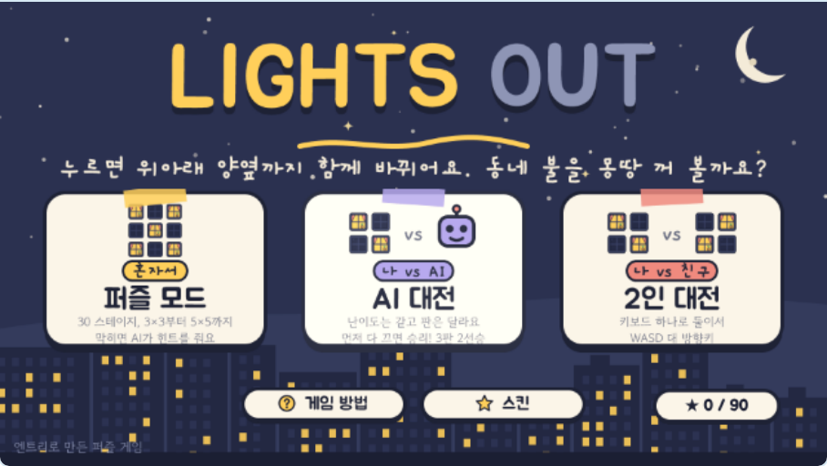
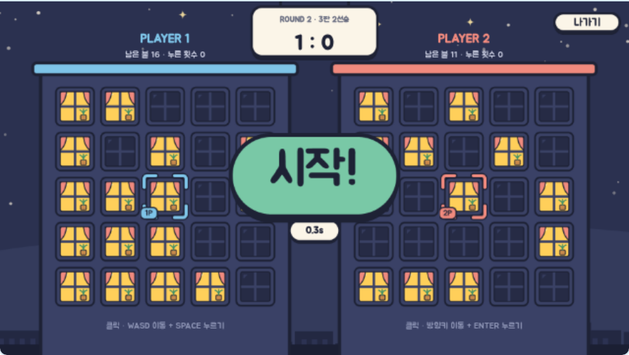
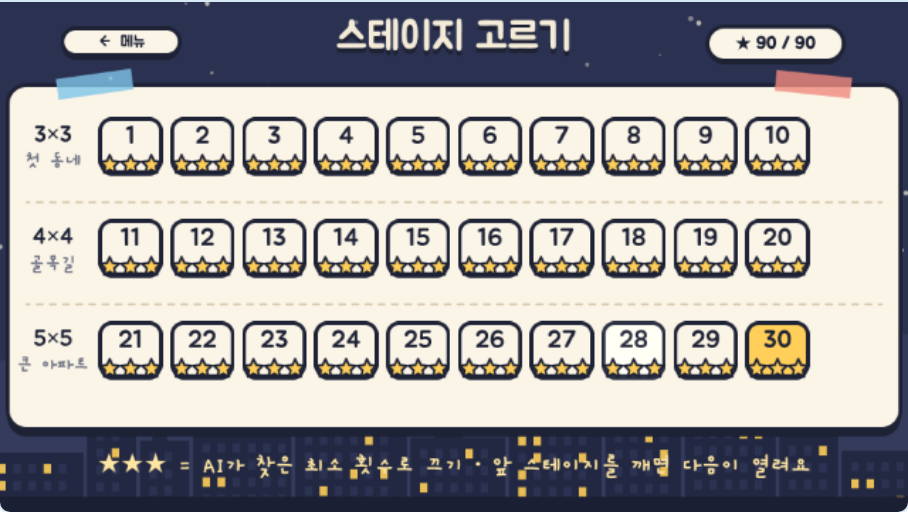
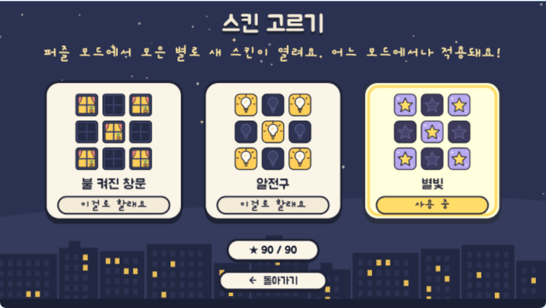
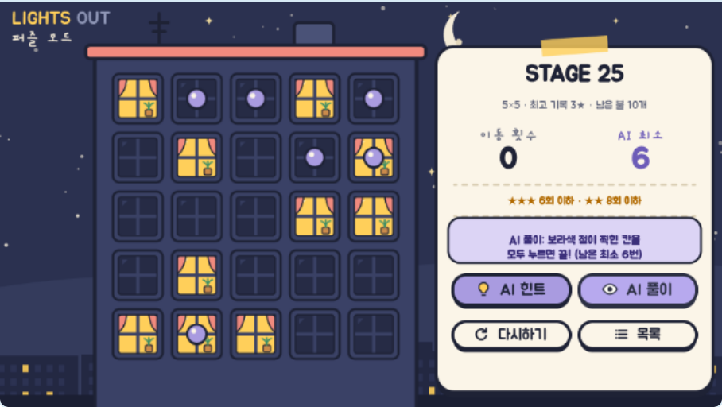
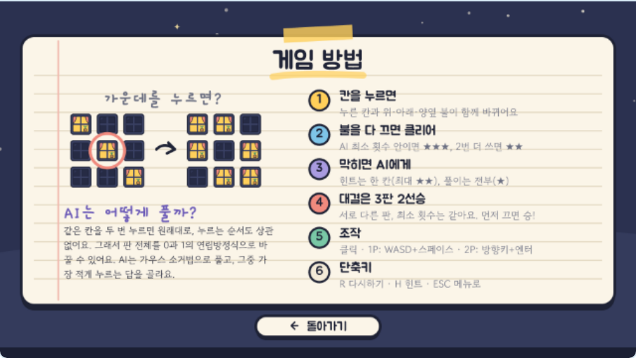
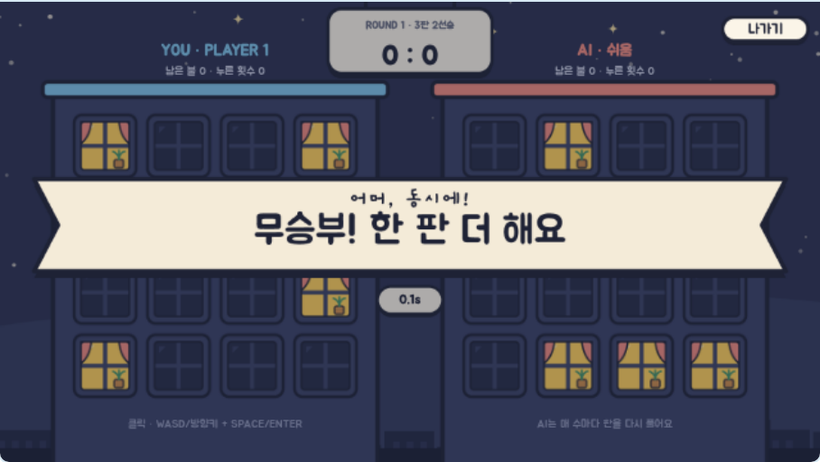
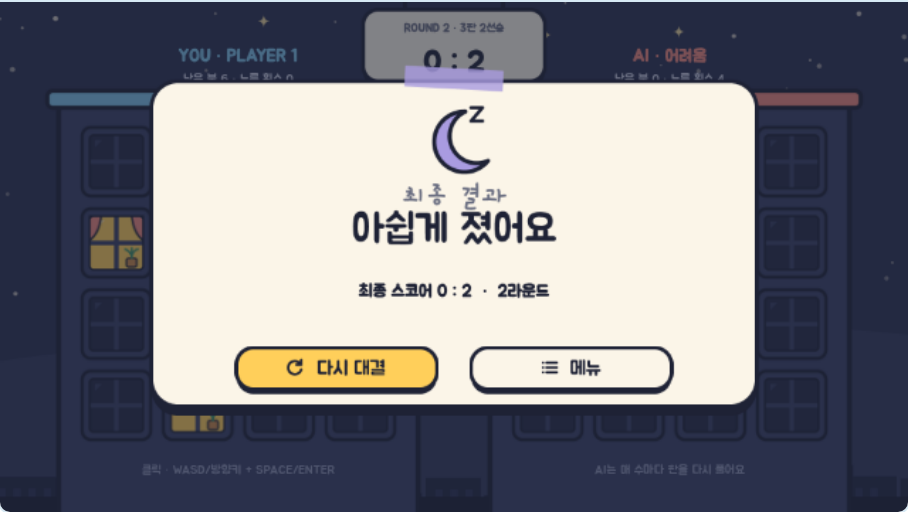
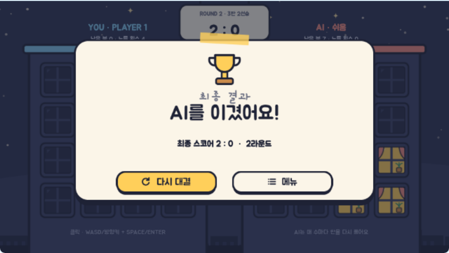
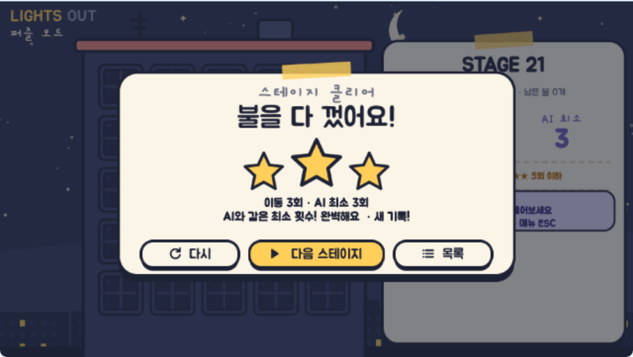

# LIGHTS OUT — 설계 · 조사 · 검증 보고서

> 칸을 누르면 그 칸과 상하좌우가 뒤집히는 퍼즐. 모든 불을 끄면 이깁니다.
> **퍼즐 모드(1인, AI 힌트/풀이)** · **AI 대전(1인 vs AI)** · **2인 대전(한 키보드)** 을 한 작품에 담았습니다.

| 타이틀 | 퍼즐 모드 (AI 힌트) |
|---|---|
|  |  |
| **AI 대전 (쉬움, 4×4)** | **2인 대전 (5×5)** |
|  |  |

완성 파일: [`dist/LIGHTS_OUT.ent`](../dist/LIGHTS_OUT.ent) · 전체 블록: [LIGHTS_OUT_BLOCKS.md](LIGHTS_OUT_BLOCKS.md) · 공유용 작품 설명: [LIGHTS_OUT_DESCRIPTION.md](LIGHTS_OUT_DESCRIPTION.md)

---

## PART 1. 엔트리 스태프 선정 · 인기 작품 조사

### 1-1. 조사 방법과 한계 (먼저 밝혀 둡니다)

작업 환경의 네트워크 정책 때문에 **playentry.org, 엔트리 CDN(entry-cdn.pstatic.net), 나무위키에 직접 접속할 수 없었습니다.**
그래서 작품을 직접 실행하거나 화면을 볼 수는 없었고, **검색 엔진에 색인된 작품 제목·설명과 스태프 선정 기준 문서**를 근거로 분석했습니다.
아래 표의 "확인한 정보"는 검색 결과에 실제로 나온 내용만 적었고, 화면 구성처럼 확인하지 못한 부분은 추측하지 않았습니다.

### 1-2. 스태프 선정 제도와 기준

- 엔트리 운영진이 **매주 화요일 4개**를 골라 메인 화면 맨 위에 노출하고, 운영자가 작품 댓글로 **선정 이유**를 남깁니다. 제목의 **[스인]** 은 "스태프 선정 + 인기 작품" 뱃지를 받은 작품을 뜻합니다.
- 선정 기준 3가지 ([엔트리/작품 공유하기 문서](https://namu.wiki/w/%EC%97%94%ED%8A%B8%EB%A6%AC/%EC%9E%91%ED%92%88%20%EA%B3%B5%EC%9C%A0%ED%95%98%EA%B8%B0), [스태프 선정 목록](https://playentry.org/project/list/staffpick)):

| 기준 | 내용 | 이 작품에서의 대응 |
|---|---|---|
| **독창성** | 기존과 다른 유형, 같은 장르라도 의도적으로 차별화 | 흔한 "혼자 푸는 라이츠아웃"이 아니라 **AI 풀이기(가우스 소거)** 로 힌트·풀이·AI 상대를 만들고, **난이도가 똑같은 서로 다른 판으로 겨루는 스피드 대전**이라는 규칙을 더함 |
| **완성도** | 오류가 없는가, 이미지·소리 등 다양한 요소 활용 | 실제 엔진 자동 테스트 47개(오류 0), Figma 에서 그린 전용 그림 139장, **효과음 10종**, 도움말·스킨·결과 화면까지 구성 |
| **발전 가능성** | 제작 시간·업데이트 주기, 앞으로 더 좋은 작품을 만들 역량 | 코드로 생성하므로 스테이지·스킨·난이도를 숫자만 바꿔 확장 가능 (PART 5) |

### 1-3. 참고한 작품

| 작품 | 확인한 정보 | 가져온 요소 |
|---|---|---|
| [[스인] ON-OFF-퍼즐 게임](https://playentry.org/project/5c431722112ab867a6889f89) | 전구 퍼즐, **200 스테이지**, 화면의 모든 전구를 켜면 클리어, 진행할수록 전구 수와 난이도 증가, 클리어 보상 "라이트코인"으로 **전구 스킨** 구매 | ① 전구 테마 ② **3×3 → 4×4 → 5×5 로 커지는 30 스테이지** ③ 모은 **별로 전구 스킨 해금** (수집 동기) |
| [_초고퀄 AI 오목 게임_ [OMOK 도장]](https://playentry.org/project/687125059d36626334a10ae2), [오목 AI와 오목 대결하기](https://playentry.org/project/6635f9454be8d030c3514613) | AI 상대와 두는 보드게임이 "초고퀄"을 내세워 인기 | **AI 상대 + 난이도 선택**, 제목 화면·결과 화면 등 연출에 공을 들임 |
| [2인용 (1인용)게임모음](https://playentry.org/project/630abfb375eadc030eacf15d), [1인용 게임](https://playentry.org/project/5de38eda9fb64b002bdb2ee7) | 1인/2인 모드를 한 작품에서 고르는 구성이 흔함 | 타이틀에서 **퍼즐(1P) · AI 대전(1P vs AI) · 2인 대전(1P vs 2P)** 카드로 바로 선택 |
| [[스인] 이진수 카드게임](https://playentry.org/project/5f4470438634ed040050ee4b) | "이진수 카드게임, 이젠 게임으로!" — 수학 개념을 게임으로 | 도움말에 **"AI는 어떻게 풀까?"** — 0/1 연립방정식(mod 2)과 가우스 소거를 쉬운 말로 설명 |
| [[스인] NO SIGNAL](https://playentry.org/project/668c104f9a37787773629493) | 2024년 1월 시작 → 7월 31일 완성, 반년 넘게 다듬은 작품 | 완성도 = 오류 없는 흐름: 모든 화면 전환·중간 나가기·재대결을 자동 테스트로 확인 |
| [슬라이딩 퍼즐(귀여운 캐릭터와 함께!)](https://playentry.org/project/672f79165d5d360337a57b5c) | 퍼즐 장르가 꾸준히 만들어짐 | 퍼즐 장르에서 차별점이 필요 → AI · 대전 |

(그 밖에 검색된 [스인] 작품: [새학기 시뮬레이션](https://playentry.org/project/65dd815a914cdc0025a817f3), [Enform](https://playentry.org/project/646dc3847f5b9b003891bbd0), [산타 돕기](https://playentry.org/project/675fc249e55b8cb99f95d4f3) — 제목 외 정보는 확인하지 못함)

### 1-4. 분석 → 설계 원칙

1. **첫 화면에서 바로 모드 선택** — 설명을 읽지 않아도 카드 3장(아이콘 + 한 줄 설명)으로 무엇을 할지 고름.
2. **점점 어려워지는 스테이지 + 보상** — ON-OFF 처럼 판이 커지고, 별(★1~3)과 스킨으로 다시 도전할 이유를 줌.
3. **AI 는 "보조"와 "상대" 두 역할** — 막히면 힌트(한 칸) / 풀이(전부), 대전에서는 사람처럼 커서를 움직여 누르는 상대.
4. **완성도 = 오류 없음 + 소리 + 연출** — 카운트다운, 라운드 배너, 결과 카드, 마우스 올림 효과, 누를 때 튀는 칸, 효과음.
5. **교육 플랫폼다운 한 가지 배움** — 라이츠아웃이 사실 선형대수(GF(2)) 문제라는 것.

---

## PART 2. 게임 구성

### 화면 흐름

```
TITLE ─┬─ 퍼즐 모드 → STAGES(30칸) → PUZZLE ─(클리어)→ [다음 ▶ / 다시 / 목록]
       ├─ AI 대전  → VSSET(난이도·판 크기) → RACE(3판 2선승) → 결과 → [다시 대결 / 메뉴]
       ├─ 2인 대전 → VSSET(조작 안내·판 크기) → RACE → 결과
       ├─ 게임 방법 (규칙 · 조작 · AI 원리)
       └─ 전구 스킨 (따뜻한 전구 / 네온 사인 ★20 / 별빛 ★45)
```

| 스테이지 선택 | 스킨 | AI 풀이 보기 |
|---|---|---|
|  |  |  |

### 퍼즐 모드 (1인)

- 30 스테이지: 1~10 = 3×3, 11~20 = 4×4, 21~30 = 5×5. 이전 스테이지를 깨야 다음이 열림.
- 각 판은 **빌드할 때 AI 풀이기로 최소 누름 수(par)를 정확히 맞춰** 만든 판입니다 (par 1 → 11 로 증가).
- 별: 이동 ≤ par → ★★★ · ≤ par+2 → ★★ · 그 외 ★. **AI 힌트**를 쓰면 최대 ★★, **AI 풀이**를 보면 ★.
- 최고 기록만 남고, 총 별 20·45개에서 새 스킨이 열리며 클리어 화면에 알려 줍니다.

### AI 대전 (1인 vs AI)

- 두 사람(나와 AI)은 **서로 다른 판**을 받지만, 두 판의 **최소 누름 수는 똑같습니다**. 먼저 모든 불을 끄면 라운드 승리. **3판 2선승.**
- 판은 매 라운드 무작위 생성 → AI 풀이기로 최소 누름 수가 **4×4: 4~6, 5×5: 6~9** 인 판만 채택 (너무 쉽거나 어려운 판 제외).
- 같은 프레임에 둘 다 끄면 **무승부** — 점수 없이 그 라운드를 다시 합니다.

#### 따라 하기 방지 (AI 를 보고 그대로 누르는 악용 막기)

처음 버전은 두 판이 완전히 똑같았습니다. 라이츠아웃은 누르는 순서가 상관없으므로, AI 커서가 가는 칸을 그대로 내 판에 따라 누르면 생각하지 않고도 판이 풀렸고, 마지막 칸을 AI 와 같은 순간에 누르면 동점 처리(1P 우선) 덕분에 이길 수도 있었습니다.

| 고친 점 | 방법 |
|---|---|
| 판을 서로 다르게 | 상대 판을 먼저 만들고, 내 판은 **최소 누름 수가 정확히 같은** 다른 판이 나올 때까지 AI 풀이기로 다시 만든다 → 공정함은 그대로, 상대의 정답은 내 판의 정답이 아님 |
| 거울처럼 따라 하기도 차단 | 내 판이 상대 판을 **회전(90·180·270°)하거나 뒤집은 모양**과 같으면 다시 만든다 (`판 비교` 함수, 8가지 대칭) |
| 동점 판정 | 같은 프레임에 둘 다 끄면 1P 승리가 아니라 **무승부 → 라운드 다시** |
| 2인 대전도 같은 규칙 | 옆 사람 판을 보고 따라 누르는 것도 소용없게 |

엔진 테스트(09)가 실제로 악용을 재현합니다: AI(어려움)가 누를 때마다 같은 칸을 내 판에 따라 누르게 하면, AI 가 먼저 끝내고 **내 판에는 불이 그대로 남습니다**(예: 따라 누름 3번 뒤 남은 불 11개).
- AI 는 매 수마다 **자기 판을 다시 풀어** 최소 해의 한 칸을 골라, 커서를 옮긴 뒤 누릅니다.

| 난이도 | 누름 간격 | 실수 확률 | 특징 |
|---|---|---|---|
| 쉬움 | 약 3.0초 (±20%) | 35% | 가끔 엉뚱한 칸을 누름 → 다시 풀어서 수습 |
| 보통 | 약 1.9초 | 15% | |
| 어려움 | 약 1.1초 | 0% | 항상 최소 누름 수로 끝냄 (테스트로 확인) |

### 2인 대전 (한 키보드)

- AI 대전과 같은 규칙(서로 다른 판, 같은 최소 횟수, 3판 2선승, 동시에 끄면 무승부).
- P1(왼쪽 판): **WASD 이동 + 스페이스**, P2(오른쪽 판): **방향키 이동 + 엔터**, 둘 다 마우스 클릭도 가능.
- 두 사람의 키가 서로의 커서를 움직이지 않음(테스트로 확인).

### 조작 · 단축키

| 키 | 동작 |
|---|---|
| 마우스 클릭 | 칸 누르기 · 버튼 |
| W A S D / 방향키 | 커서 이동 (퍼즐 모드에서도 사용 가능) |
| 스페이스 / 엔터 | 커서 칸 누르기 |
| H | AI 힌트 (퍼즐) |
| R | 다시하기 (퍼즐) |
| Esc | 메뉴로 |

---

## PART 2.5 디자인 — Figma 로 다시 그리기

| 이전 (네온 · 그라디언트) | 지금 (밤 동네 일러스트) |
|---|---|
| 빛 번짐, 그라디언트, 자간 넓은 영문 라벨 → "자동으로 만든" 느낌 | 크림색 종이 카드 + 잉크 테두리 + 번지지 않는 그림자(스티커), 마스킹 테이프, 공책 줄, 손글씨 메모 |

- **콘셉트:** "밤 11시, 동네 불을 모두 꺼 주세요." 판은 아파트 외벽이고 칸은 창문입니다(불 켜진 창에는 커튼과 화분). 대전은 두 건물이 나란히 서고, 가운데에 점수판이 매달려 있습니다.
- **글꼴:** 제목·숫자는 Jua, 메모는 Gaegu(손글씨), 본문은 Gowun Dodum입니다. 게임 안 글상자는 엔트리 기본 글꼴 중 가장 비슷한 **나눔스퀘어라운드**를 씁니다.
- **색:** 밤하늘 네이비, 크림 종이, 잉크(#1E2235)에 포인트 색 4가지(노랑 = 불빛·1등, 하늘 = 1P, 산호 = 2P, 라일락 = AI)를 씁니다.
- **문구:** 반말과 존댓말을 섞은 말투로 썼습니다. 예: "여기!", "이걸로 할래요", "어머, 동시에!", "아쉽게 졌어요".

### Figma 작업 과정

1. `tools/figma/lo_design.js` 가 그림 139장을 **벡터(SVG) + 텍스트 레이어**로 설계합니다. 이 코드는 Figma 플러그인 환경에서도 그대로 실행됩니다.
2. Figma MCP 의 `use_figma` 로 스크립트(`tools/figma/out/lo_figma_build.js`)를 실행합니다. Figma 파일 안에 그림마다 프레임이 생깁니다.
   - 벡터는 편집 가능한 Vector 레이어로, 글자는 Jua·Gaegu·Gowun Dodum 텍스트 레이어로 만들어집니다.
   - 칸 그림 6개는 **컴포넌트**로 만들고, 카드·스킨 미리보기·도움말의 작은 판은 그 **인스턴스**로 구성했습니다. 컴포넌트 하나를 고치면 모두 바뀝니다.
3. 그림을 가져오는 방법:
   - Figma 의 내보내기 URL(`www.figma.com`)은 이 작업 환경의 네트워크 정책에서 막혀 있어서, `get_screenshot` 으로 시트 전체를 **2배 해상도**로 받았습니다.
   - 스크린샷은 투명한 부분을 배경색으로 채우므로, **검은 배경·흰 배경으로 한 번씩** 캡처해 픽셀마다 투명도를 계산했습니다(α = 1 − (흰 − 검)/255).
   - 받은 캡처는 `tools/figma/export/` 에 있고, `npm run lo:slice` 로 그림 139장과 섬네일로 자릅니다.
4. `tools/figma/lo_preview.js` 는 같은 설계를 로컬 Chromium 에 같은 글꼴로 그려서, Figma 에 올리기 전에 미리 확인하는 데 씁니다.
5. 그림 몇 장만 고칠 때는 `lo_figma_patch.js` 로 그 프레임만 Figma 에서 다시 만들고, `lo_sheet_patch.js` 로 저장해 둔 캡처에 덮어씁니다.

| 타이틀 | 스테이지 | 스킨 |
|---|---|---|
|  |  |  |
| **게임 방법** | **무승부** | **2인 대전** |
|  |  |  |

---

## PART 3. AI 원리 — 라이츠아웃은 연립방정식

- 같은 칸을 두 번 누르면 원래대로 → 각 칸은 **누른다(1)/안 누른다(0)** 만 의미가 있고, 순서는 상관없습니다.
- 칸 j 를 누를 때 뒤집히는 불을 열 j 로 하는 행렬 A 를 만들면, 불 상태 b 를 끄는 누름 x 는 **A·x = b (mod 2)** 의 해입니다.
- 빌드 스크립트(`tools/lo_solver.js`)가 [A | I] 를 GF(2) 가우스 소거해 **해 행렬 M** 과 **영공간(누러도 판이 안 바뀌는 조합)** 을 구합니다.

| 판 | 계수(rank) | 영공간 | 해의 개수 | AI 가 비교하는 조합 |
|---|---|---|---|---|
| 3×3 | 9/9 | 0 | 1 | 1 |
| 4×4 | 12/16 | 4차원 | 16 | 16 |
| 5×5 | 23/25 | 2차원 | 4 | 4 |

- 엔트리에서는 `x_i = (M_i 에 속한 칸의 불 합) mod 2` 를 **반복 블록 없이 펼쳐서** 계산합니다
  (엔트리의 반복 블록은 한 바퀴마다 한 프레임 쉬므로, 펼쳐야 한 프레임 안에 끝납니다).
- 그다음 영공간 조합마다 누름 수를 세서 가장 적은 해를 고릅니다 → 이것이 **"AI 최소 횟수"**, 힌트, 풀이, AI 상대의 공통 두뇌입니다.

---

## PART 4. 엔트리 구현

### 오브젝트 (위 = 앞)

| 오브젝트 | 종류 | 역할 |
|---|---|---|
| 게임 | 관리자(숨김) | 초기화, 메인 루프(라운드 승패 판정), 버튼 처리, 키보드, 라운드 진행(카운트다운), AI 플레이어 |
| 소리 | 관리자(숨김) | `소리대기` 리스트에 들어온 효과음을 차례로 재생 (효과음 10종) |
| 별표시 | 복제본 30 | 스테이지 타일의 ★ / 자물쇠 |
| 버튼 | 복제본 58 | 모든 버튼. `버튼상태`(0 숨김·1 보통·3 흐림·4 보이기만) · `버튼모양` 리스트를 보고 그림을 바꿈, 마우스를 올리면 밝아짐 |
| 결과문구 · 별개수 · … | 글상자 17개 | 이동 수, AI 최소 수, 별 조건, AI 안내, 점수, 라운드, 시간, 이름, 남은 불, 조작 안내 |
| 오버레이 | 스프라이트 | 클리어 카드 · 3·2·1·GO · 라운드 배너 · 대전 결과 |
| 커서 | 복제본 2 | P1 / P2·AI 커서 (목표 칸으로 부드럽게 따라감) |
| AI표시 | 복제본 25 | 힌트 칸 테두리, 풀이 칸 점 (클릭은 아래 칸으로 넘김) |
| 칸 | 복제본 50 | 보드1 25칸 + 보드2 25칸. 값이 바뀌면 모양 변경 + 살짝 튀는 연출 |
| 배경 | 스프라이트 | 화면별 배경 8장 (Figma 에서 그린 밤 동네 일러스트) |

### 함수 (20개)

`칸 뒤집기` · `누르기` · **`풀이 계산`**(AI) · `풀이 칸 고르기` · `판 불러오기` · `무작위 판` · `판 복사` · `배치 갱신` · `버튼 갱신` · `화면 이동` · `총별 계산` · `스테이지 시작` · `스테이지 클리어` · `힌트 보기` · `풀이 보기 전환` · `플레이어 누름` · `커서 이동` · `마우스 칸 누르기` · `대전 시작` · `판 비교`(대칭까지 같은 판 거르기)

### 주요 데이터

| 리스트 | 내용 |
|---|---|
| `보드1`, `보드2` | 각 25칸의 불(0/1). 판 크기가 작으면 앞쪽 n² 칸만 사용 |
| `풀이입력`, `풀이` | AI 풀이기의 입력(불)과 출력(누를 칸) |
| `스테이지판`, `스테이지크기`, `스테이지최소` | 30 스테이지 (예: `"110100000"`, 3, 1) |
| `별` | 스테이지별 최고 별 |
| `버튼X/Y/W/H/상태/모양` | 버튼 58개 |
| `소리대기` | 재생할 효과음 이름 대기열 |

### 이 작품에서 새로 알게 된 엔트리 특성

- **`~이 될 때까지 반복하기`는 조건을 먼저 확인합니다.** 라운드 판 생성 루프가 퍼즐 모드에서 남은 `풀이수` 값 때문에 한 번도 돌지 않아 빈 판으로 대전이 시작되는 버그가 있었고, 루프 전에 `풀이수`를 -1 로 비워 해결했습니다.
- **전체 화면 오버레이 그림은 클릭을 가로챕니다.** "GO!" 가 떠 있는 0.5초 동안 칸 클릭이 먹히지 않던 문제 → GO 그림은 화면을 어둡게 하지 않고, 오버레이 클릭을 `마우스 칸 누르기` 함수로 아래 칸에 넘김. 같은 이유로 AI 표시·커서 클릭도 아래 칸으로 넘깁니다.
- **변수 이름은 작품 전체에서 겹치면 안 됩니다** (오브젝트 지역 변수 포함). 생성 도구(`entrygen.js`)가 같은 이름을 만들면 오류를 내도록 했습니다.
- `글자 추출`(char_at) 은 범위를 벗어나면 작품이 멈춤 → 판 크기별로 나눠 필요한 칸만 읽음.
- 함수의 매개변수 값은 호출할 때 한 번 계산됩니다(`무작위 수`를 넘겨도 안전).
- 효과음은 `.ent` 안에 `temp/xx/yy/sound/<id>.mp3` 로 넣고, 오브젝트 `sounds` 에 `fileurl`·`duration` 을 적습니다.

---

## PART 5. 확장하기

| 바꾸고 싶은 것 | 고칠 곳 |
|---|---|
| 스테이지 수·난이도 | `tools/lo_solver.js` 의 `STAGE_PLAN` ([판 크기, par] 목록) + 스테이지 타일 배치(`lo_layout.js`) |
| AI 난이도 | `lo_layout.js` 의 `AI_LEVELS` (간격, 실수 확률) |
| 대전 판 난이도 | `RACE_RANGE` (크기별 최소 누름 수 범위) |
| 스킨 · 그림 | `SKINS` + `tools/figma/lo_design.js` 의 `cellInner` 등 → Figma 빌드 → `npm run lo:slice` |
| 효과음 | `tools/lo_sound.js` 의 `SOUNDS` (음 높이·길이) |

---

## PART 6. 검증

### 6-1. 풀이기 자체 검증 (`npm run lo:test:solver`)

가우스 소거와 **다른 방법**으로 최소 누름 수를 구해 비교합니다.

```
PASS 3×3: 풀 수 있는 판 512개 전부 해가 맞고 최소 누름 수 = BFS — 오류 0
PASS 4×4: 풀 수 있는 판 4096개 전부 해가 맞고 최소 누름 수 = BFS — 오류 0
PASS 5×5: 무작위 3000판 — 풀 수 있는지 판정 + 최소 누름 수 = 불 쫓기 전수 탐색 — 오류 0, 풀 수 없는 판 2259개 일치
PASS 스테이지 30개: 표시하는 AI 최소 횟수(par)가 독립 계산과 같음
PASS 스테이지 생성은 결정적(빌드마다 같은 판)
```

### 6-2. 실제 엔트리 엔진 테스트 (`npm run lo:test`, entryjs 4.0.23 + Chromium)

`.ent` 를 실제 엔트리 워크스페이스에 불러와 마우스·키보드로 조작합니다. **47/47 PASS, 실행 중 오류 0.**

| # | 검사 | 결과 |
|---|---|---|
| 01–03 | 타이틀 버튼, 방법·스킨 화면, 잠긴 스킨·스테이지는 선택 불가 | PASS |
| 04 | **엔진 안의 AI 풀이기**: 3×3·4×4·5×5 무작위 30판 — 해가 판을 끄고, 최소 누름 수가 기준과 같음 | 30/30 |
| 05 | AI 힌트 = 최소 해의 한 칸, 힌트 사용 시 최대 ★★ | PASS |
| 06 | WASD 이동·경계, 스페이스 누르기(이웃까지 뒤집힘), R 다시, H 힌트, Esc 메뉴 | PASS |
| 07 | **30 스테이지 전부** 최소 수로 클리어 → 모두 ★★★, 총 90★, 총 별이 20·45개를 넘는 순간 스킨 해금 알림, 마지막 [다음] 비활성, AI 풀이 보기 갱신, 최고 기록 유지 | PASS |
| 08 | 스킨 3종 선택·적용 | PASS |
| 09 | AI 대전(어려움): **두 판이 서로 다르고(회전·뒤집기로도 다름) 최소 누름 수는 같음**, **AI 를 따라 눌러도 내 판은 풀리지 않음**, AI 는 정확히 최소 누름 수로 끔, 2선승 → 패배 화면 | PASS |
| 10 | AI 대전(쉬움): 사람이 먼저 끄면 라운드 승리, 2:0 → 승리 화면 | PASS |
| 10b | 같은 순간에 둘 다 끄면 무승부 → 점수 없음, 다음 라운드 | PASS |
| 11 | 2인 대전(5×5): P1/P2 키 분리, P1 키보드 승 → P2 키보드 승 → P2 마우스 승 = 1:2, 다시 대결 초기화 | PASS |
| 12 | 카운트다운 중 나가기 / 대전 중 Esc → 남은 스레드가 화면을 바꾸거나 AI 가 더 누르지 않음, **대전 중 약 60 fps** | PASS |
| 13 | 효과음 10종 MP3 디코딩, 대기열 비워짐 | PASS |
| 99 | 실행 중 런타임 오류 없음 | PASS |

| AI 가 이긴 대전 | 사람이 이긴 대전 | 5×5 클리어 |
|---|---|---|
|  |  |  |

### 6-3. 알려진 한계

- **진행 기록(별·스킨)은 작품을 다시 시작하면 초기화됩니다.** 엔트리에서 영구 저장은 로그인이 필요한 클라우드 변수뿐이라, 오프라인 `.ent` 에서도 동작하도록 쓰지 않았습니다.
- 5×5 대전의 "어려움" AI 는 약 1.1초마다 정확히 최소 해를 누르므로 사람이 이기기 매우 어렵습니다(의도한 최고 난이도). 처음에는 4×4 · 쉬움/보통을 권합니다.
- 테스트는 오픈소스 entryjs 엔진(4.0.23)과 Chromium 에서 했습니다. playentry.org 사이트 자체에서의 불러오기는 이 환경에서 접속할 수 없어 확인하지 못했습니다.
- 글꼴: 그림 속 글자는 Figma 에서 Jua·Gaegu·Gowun Dodum 으로 그렸고, 게임 안 글상자는 엔트리 기본 글꼴인 나눔스퀘어라운드를 씁니다. 테스트 하네스에는 나눔스퀘어라운드가 없어 Jua 로 대신 보여 줍니다.
- Figma 파일의 그림을 바로 내보내는 URL 은 이 작업 환경에서 접속할 수 없어 스크린샷 2장으로 투명도를 계산했습니다. 결과는 원본과 같지만, Figma 그림을 고친 뒤에는 다시 캡처해야 합니다.
